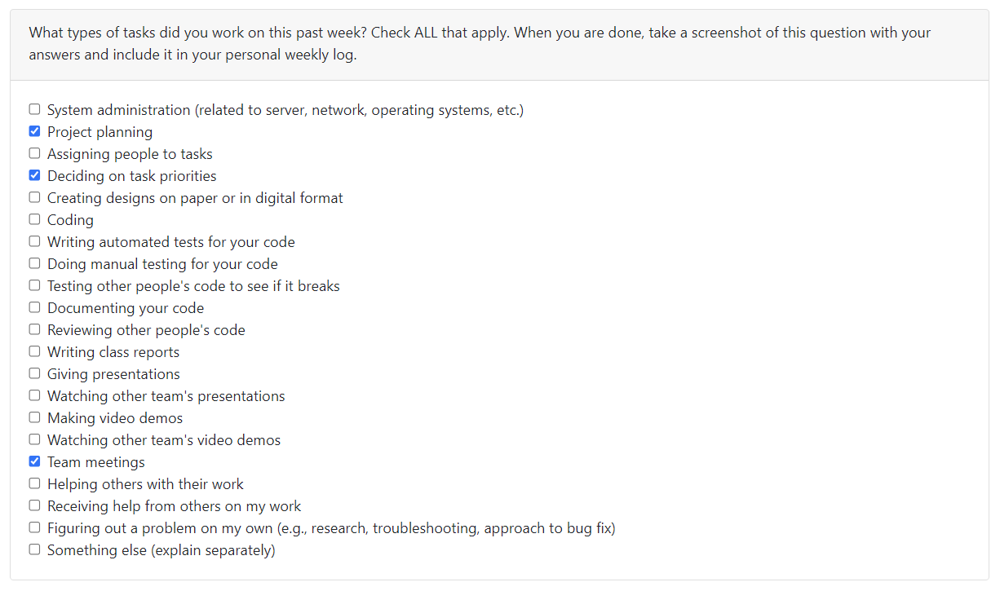

# Weekly Personal Log - Alexander Roizman

### Date Range
 - September 25 - October 1, 2023

### Task Types

### Weekly Goals
- Make decisions regarding the framework and stack we are going to use.
- Finish the project plan
- Start learning the skills that we are missing.
  

#### Individual goals:
- Contribute to team goals
- Review front end in general
- Start learning react native
- Help with project plan
- Set up necessary tech stack
- Keep comunicating

### Features
- Project Plan
