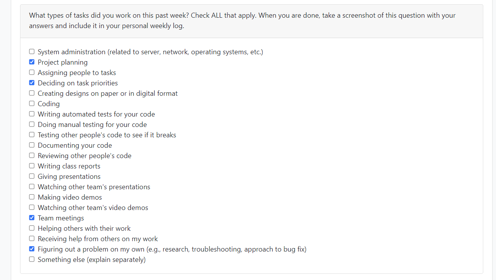

# Weekly Personal Log - Alexander Roizman

### Date Range
 - September 25 - October 1, 2023

### Task Types

### Weekly Goals
- Make decisions regarding the framework and stack we are going to use.
- Finish the project plan
- Start learning the skills that we are missing.
  

#### Individual goals:
- Contribute to team goals
- Review front end in general
- Start learning react native
- Help with project plan
- Set up necessary tech stack
- Keep comunicating

### Features
- Project Plan

### Work Period
 - October 2 - 8, 2023

### Task Types

### Recap of Students Goals

- Get familiar with Django and React Native
- Do a test project to get familiar with the environment
- Start the design/planning for Signup/Login and Home page
- Get familiar with github
- Keep communicating 

### Student Tasks on Project Board

- item#1 set up project environment
- item#2 create group figma 
- item#3 create mockups in figma for ui/ux
- item#4 paper prototyping
- item#5 user testing

### Which Tasks Are Completed vs. In Progress

| Item # | Completed | To Be Done |
|:------:|:----------|:-----------|
|   1    | ✓         |            |
|   2    | ✓         |            |
|   3    |           | ✓          |
|   4    |           | ✓          |
|   5    |           | ✓          |
