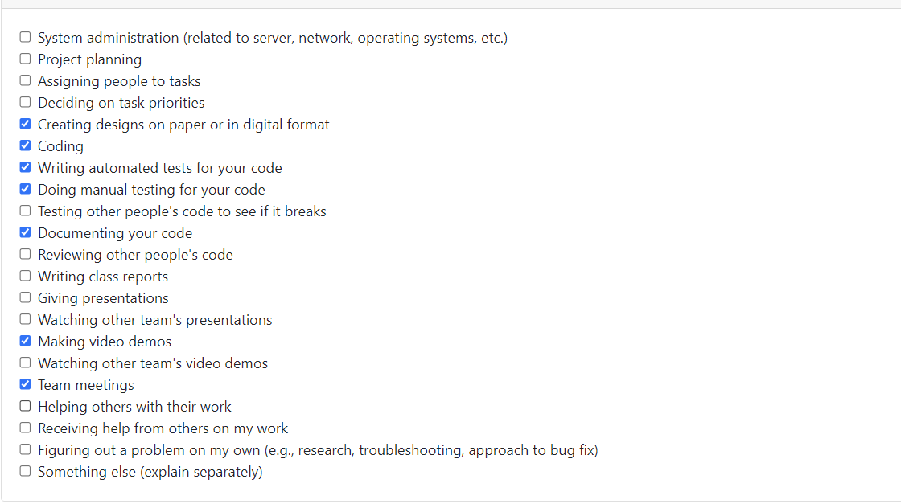

# Weekly Personal Log - Alexander Roizman

### Date Range
 - September 25 - October 1, 2023

### Task Types

### Weekly Goals
- Make decisions regarding the framework and stack we are going to use.
- Finish the project plan
- Start learning the skills that we are missing.
  

#### Individual goals:
- Contribute to team goals
- Review front end in general
- Start learning react native
- Help with project plan
- Set up necessary tech stack
- Keep comunicating

### Features
- Project Plan

### Work Period
 - October 2 - 8, 2023

### Task Types

### Recap of Students Goals

- Get familiar with Django and React Native
- Do a test project to get familiar with the environment
- Start the design/planning for Signup/Login and Home page
- Get familiar with github
- Keep communicating 

### Student Tasks on Project Board

- item#1 set up project environment
- item#2 create group figma 
- item#3 create mockups in figma for ui/ux
- item#4 paper prototyping
- item#5 user testing

### Which Tasks Are Completed vs. In Progress

| Item # | Completed | To Be Done |
|:------:|:----------|:-----------|
|   1    | ✓         |            |
|   2    | ✓         |            |
|   3    |           | ✓          |
|   4    |           | ✓          |
|   5    |           | ✓          |

### Work Period
 - October 9 - 22, 2023

### Task Types

### Recap of Students Goals

- Design Login and Signup in Figma
- Do the front end for login and signup 
- Do a simple homepage to check if validation is working
- Keep communicating 

### Student Tasks on Project Board

- item#1 create mockups in figma for ui/ux
- item#2 paper prototyping
- item#3 front-end design for login/signup page using react native
- item#4 create homepage
- item#5 user testing

### Which Tasks Are Completed vs. In Progress

| Item # | Completed | To Be Done |
|:------:|:----------|:-----------|
|   1    |           | ✓          |
|   2    | ✓         |            |
|   3    | ✓         |            |
|   4    |           | ✓          |
|   5    |           | ✓          |

### Work Period
 - October 23 - 29, 2023

### Task Types

### Recap of Students Goals

- Finish login and signup front end
- Add details page
- Do a prototype for the homepage 
- Unit testing for login and signup
- Tab navegation  

### Student Tasks on Project Board

- #1 login/signup testing front end 
- #2 tab navegation
- #3 homepage prototype
- #4 Details page front end

### Which Tasks Are Completed vs. In Progress

| Item # | Completed | To Be Done |
|:------:|:----------|:-----------|
|   1    | ✓         |            |
|   2    |           |  ✓         |
|   3    | ✓         |            |
|   4    | ✓         |            |

### Work Period
 - October 30 - 5, 2023

### Task Types

### Recap of Students Goals

- Advance with Home page desing
- Home page post filtering
- Home page post sorting
- Drawer navegation 

### Student Tasks on Project Board

- #1 Home page front-end
- #2 Drawer Navegation
  
### Which Tasks Are Completed vs. In Progress

| Item # | Completed | To Be Done |
|:------:|:----------|:-----------|
|   1    |           |  ✓         |
|   2    |  ✓        |            |

### Work Period
 - November 6 - 11, 2023

### Task Types

### Recap of Students Goals

- Advance with Home page Front end
- Filtering modal for homepage front end
- Sorting modal for homepage front end
- Add listing page structural front-end/implementation 

### Student Tasks on Project Board

- #1 Home page front-end
- #2 Add listing page
  
### Which Tasks Are Completed vs. In Progress

| Item # | Completed | To Be Done |
|:------:|:----------|:-----------|
|   1    |           |  ✓         |
|   2    |           |  ✓         |

### Work Period
 - November 11 - 26, 2023

### Task Types

### Recap of Students Goals

- Figma design Add Listing page
- Front end struture Add Listing Page
- Add Images fuctionality add listing page
- Continue adjusting details in homepage

### Student Tasks on Project Board

- #1 Home page front-end
- #2 Add listing page
  
### Which Tasks Are Completed vs. In Progress

| Item # | Completed | To Be Done |
|:------:|:----------|:-----------|
|   1    |           |  ✓         |
|   2    |           |  ✓         |

### Work Period
 - November 27 - 3, 2023

### Task Types

### Recap of Students Goals

- Figma design Add Listing page
- Front end Add Listing Page design 
- Front end Add Listing Page category selection
- Front end Add Listing Page Image uploads
- Front end Add Listing Page Expiration Date Selection and guidelines
- Front end Add Listing Page modals and UI

### Student Tasks on Project Board

- #1 Add listing page
- #1 Creating mockups in figma fo ui/ux

  
### Which Tasks Are Completed vs. In Progress

| Item # | Completed | To Be Done |
|:------:|:----------|:-----------|
|   1    |           |  ✓         |
|   2    |           |  ✓         |

### Work Period
 - January 7 - 14, 2024

### Task Types

### Recap of Students Goals

- Front end Add Listing Page design 
- Front end Add Listing Page category selection
- Front end Add Listing Page Image uploads
- Front end Add Listing Page Expiration Date Selection and guidelines
- Front end Add Listing Page modals and UI

### Student Tasks on Project Board

- #1 Add listing page 
- #2 Creating mockups in figma fo ui/ux

  
### Which Tasks Are Completed vs. In Progress

| Item # | Completed | To Be Done |
|:------:|:----------|:-----------|
|   1    |  ✓        |            |
|   2    | ✓         |           |

### Work Period
 - January 15 - 21, 2024

### Task Types

### Recap of Students Goals

- Front end Add Listing Page modal re-design
- Front end Forgot password re design

### Student Tasks on Project Board

- #1 Add listing fe 
- #2 Forgot Password fe

  
### Which Tasks Are Completed vs. In Progress

| Item # | Completed | To Be Done |
|:------:|:----------|:-----------|
|   1    |           |    ✓       |
|   2    | ✓         |            |

### Work Period
 - January 22 - 28, 2024

### Task Types

### Recap of Students Goals

- Front end Add Listing feature
- Front end Post details feature

https://github.com/COSC-499-W2023/year-long-project-team-8/assets/97238610/62f232a7-09fc-49a9-aba0-7cd4ed2b1157

### Student Tasks on Project Board

- #1 Add listing fe 
- #2 Post details fe

  
### Which Tasks Are Completed vs. In Progress

| Item # | Completed | To Be Done |
|:------:|:----------|:-----------|
|   1    |     ✓     |            |
|   2    |           |    ✓       |

