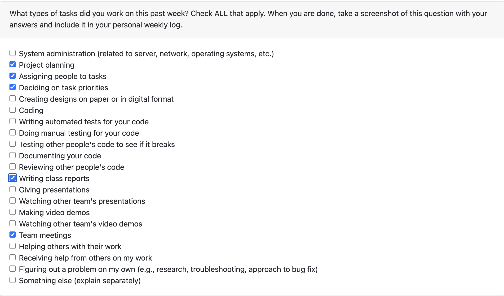
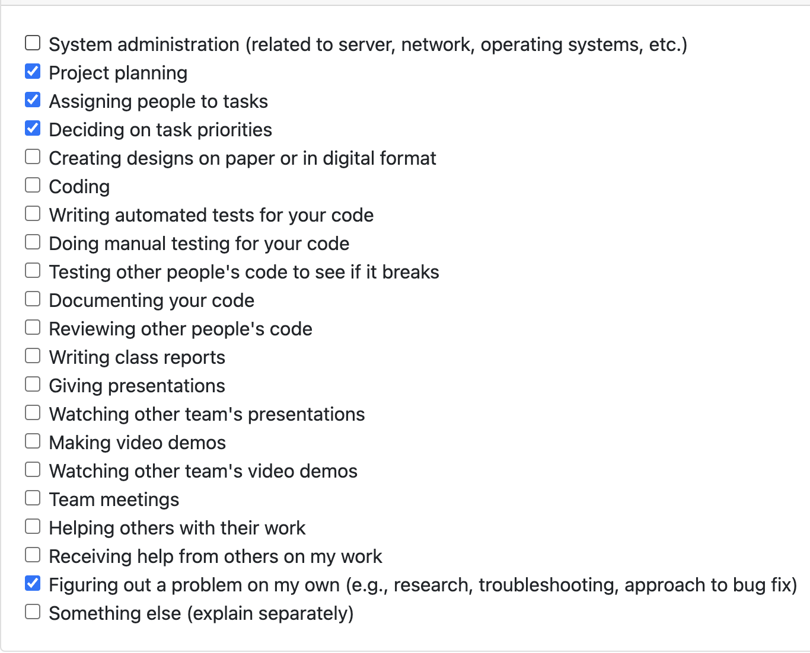

# Brandon Mack Individual Log

### Work Period
<!-- 
- start/end dates of the week
-->
September 24 - October 1, 2023

### Individual Peer Evaluation
<!-- 
- screenshot of the weekly peer evaluation
-->

### Recap of Students Goals
<!--
- what tasks are you aiming to have completed by the end of the week
-->
- Complete the project plan
- Decide on our tech stack
- Come up with the features we want to implement

### Student Tasks on Project Board
<!-- 
- Tasks undertaken on the project board
-->
- Project plan

### Which Tasks Are Completed vs. In Progress
<!--
- list of completed tasks
- list of tasks to be done
✓ x
-->

| Item # |  Item Name   | Completed | To Be Done |
|:------:|:------------:|:---------:|:----------:|
|   1    | Project Plan |     ✓     |            |

 
 

### Work Period
<!-- 
- start/end dates of the week
-->
October 1 - October 8, 2023

### Individual Peer Evaluation
<!-- 
- screenshot of the weekly peer evaluation
-->

### Recap of Students Goals
<!--
- what tasks are you aiming to have completed by the end of the week
-->
- complete setting up the development environment
- create figma account and begin basic designs

### Student Tasks on Project Board
<!-- 
- Tasks undertaken on the project board
-->
- item#1 set up project environment
- item#2 get figma up and running for design

### Which Tasks Are Completed vs. In Progress
<!--
- list of completed tasks
- list of tasks to be done
✓ x
-->

| Item # | Completed  | To Be Done |
|:------:|:-----------|:-----------|
| 1      | ✓          |            |
| 2      | ✓          |            |
