# Brandon Mack Individual Log

### Work Period
<!-- 
- start/end dates of the week
-->
September 24 - October 1, 2023

### Individual Peer Evaluation
<!-- 
- screenshot of the weekly peer evaluation
-->

### Recap of Students Goals
<!--
- what tasks are you aiming to have completed by the end of the week
-->
- Complete the project plan
- Decide on our tech stack
- Come up with the features we want to implement

### Student Tasks on Project Board
<!-- 
- Tasks undertaken on the project board
-->
- Project plan

### Which Tasks Are Completed vs. In Progress
<!--
- list of completed tasks
- list of tasks to be done
✓ x
-->

| Item # |  Item Name   | Completed | To Be Done |
|:------:|:------------:|:---------:|:----------:|
|   1    | Project Plan |     ✓     |            |

 
 

### Work Period
<!-- 
- start/end dates of the week
-->
October 1 - October 8, 2023

### Individual Peer Evaluation
<!-- 
- screenshot of the weekly peer evaluation
-->

### Recap of Students Goals
<!--
- what tasks are you aiming to have completed by the end of the week
-->
- complete setting up the development environment
- create figma account and begin basic designs

### Student Tasks on Project Board
<!-- 
- Tasks undertaken on the project board
-->
- item#1 set up project environment
- item#2 get figma up and running for design
- item#3 create mockups in figma for ui/ux
- item#4 begin paper prototyping
- item#5 user testing

### Which Tasks Are Completed vs. In Progress
<!--
- list of completed tasks
- list of tasks to be done
✓ x
-->

| Item # | Completed | To Be Done |
|:------:|:----------|:-----------|
|   1    | ✓         |            |
|   2    | ✓         |            |
|   3    |           | ✓          |
|   4    |           | ✓          |
|   5    |           | ✓          |

### Work Period
<!-- 
- start/end dates of the week
-->
October 8 - October 23, 2023

### Individual Peer Evaluation
<!-- 
- screenshot of the weekly peer evaluation
-->
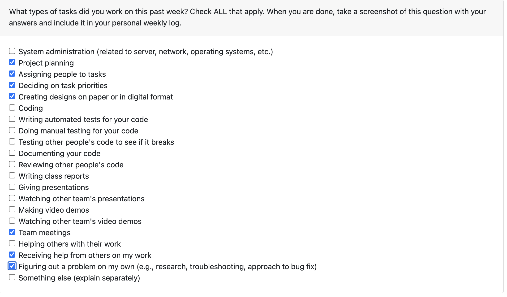

### Recap of Students Goals
<!--
- what tasks are you aiming to have completed by the end of the week
-->
- Complete profile figma page
- Implement the profile page code

### Student Tasks on Project Board
<!-- 
- Tasks undertaken on the project board
-->
- 1. Profile page 
- 2. UI/UX design

### Which Tasks Are Completed vs. In Progress
<!--
- list of completed tasks
- list of tasks to be done
-->

| Item # | Completed  | To Be Done |
|:------:|:-----------|:-----------|
| 1      |            |      ✓      |
| 2      |     ✓       |            |

### Work Period
<!-- 
- start/end dates of the week
-->
October 23 - October 30, 2023

### Individual Peer Evaluation
<!-- 
- screenshot of the weekly peer evaluation
-->

### Recap of Students Goals
<!--
- what tasks are you aiming to have completed by the end of the week
-->
- profile page ui/ux
- profile page front/backend connections
- documentation

### Student Tasks on Project Board
<!-- 
- Tasks undertaken on the project board
-->
- 1. profile page
- 2. documentation
- 3. getting live demo up and running

### Which Tasks Are Completed vs. In Progress
<!--
- list of completed tasks
- list of tasks to be done
✓ 
-->

| Item # | Completed   | To Be Done  |
|:------:|:------------|:------------|
| 1      | ✓           |             |
| 2      |             | ✓           |
| 3      |             | ✓           |

### Work Period
<!-- 
- start/end dates of the week
-->
October 30 - November 6, 2023

### Individual Peer Evaluation
<!-- 
- screenshot of the weekly peer evaluation
-->
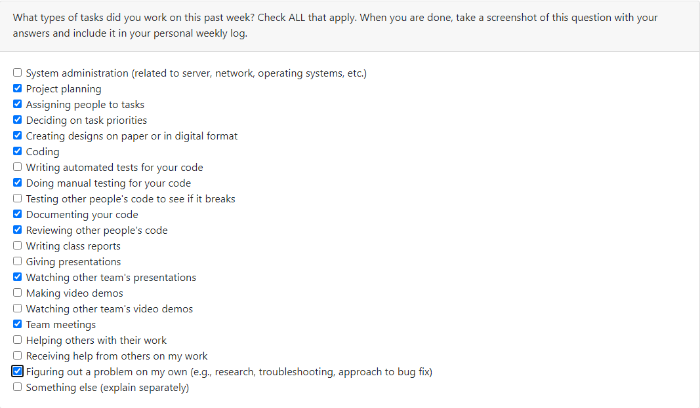

### Recap of Students Goals
<!--
- what tasks are you aiming to have completed by the end of the week
-->
- profile page documentation
- profile page button functionality
- settings button to open a drawer
- in drawer have the ability to log out and edit the profile
- complete testing for profile page

### Student Tasks on Project Board
<!-- 
- Tasks undertaken on the project board
-->
1. profile page button functionality
2. settings button to open drawer
3. settings drawer has ability to log out
4. create edit profile functionality
5. create edit profile page
6. profile page documentation
7. profile page implementation
8. live demo 

### Which Tasks Are Completed vs. In Progress
<!--
- list of completed tasks
- list of tasks to be done

-->

| Item # | Completed   | To Be Done  |
|:------:|:-----------:|:-----------:|
| 1      |      ✓      |             |
| 2      |      ✓      |             |
| 3      |             |      ✓      |
| 4      |             |      ✓      |
| 5      |             |      ✓      |
| 6      |             |      ✓      |
| 7      |       ✓     |             |
| 8      |       ✓     |             |

# Team_Member_Name Log

### Work Period
<!-- 
- start/end dates of the week
-->
November 6 - November 13, 2023

### Individual Peer Evaluation
<!-- 
- screenshot of the weekly peer evaluation
-->
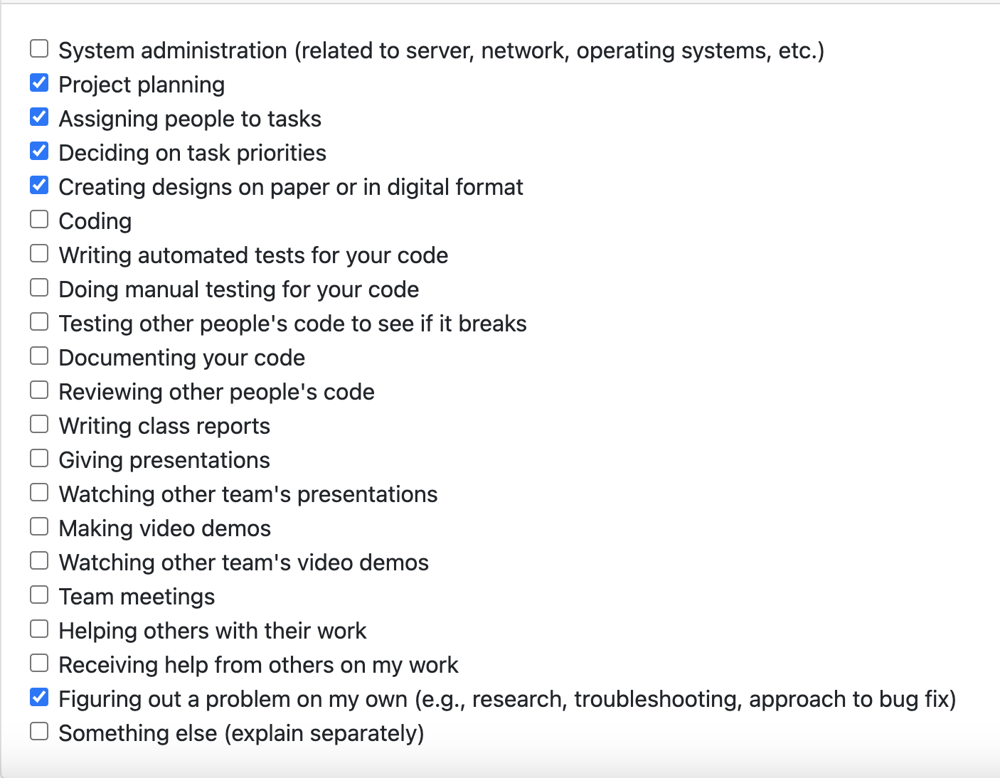

### Recap of Students Goals
<!--
- what tasks are you aiming to have completed by the end of the week
-->
** My laptop is currently broken so I was unable to complete any code this week thus I had a larger commit the previous week and will be aiming to finish a couple features over reading break. I spent my time this week working on figma and paper prototyping due to this **

- finish profile page documentation
- finish profile page drawer
- begin working on the users post page

### Student Tasks on Project Board
<!-- 
- Tasks undertaken on the project board
-->
- 1. profile page functionality
- 2. settings button to open drawer
- 3. create the edit profile page
- 4. begin design and implementation of the user post page

### Which Tasks Are Completed vs. In Progress
<!--
- list of completed tasks
- list of tasks to be done

-->

| Item # | Completed  | To Be Done |
|:------:|:-----------|:-----------|
| 1      |            |     ✓       |
| 2      |     ✓       |           |
| 3      |            |     ✓       |
| 4      |      ✓      |            |

### Work Period
<!-- 
November 13 - November 26, 2023
-->
November 13 - November 26, 2023

### Individual Peer Evaluation
<!-- 
- screenshot of the weekly peer evaluation
-->
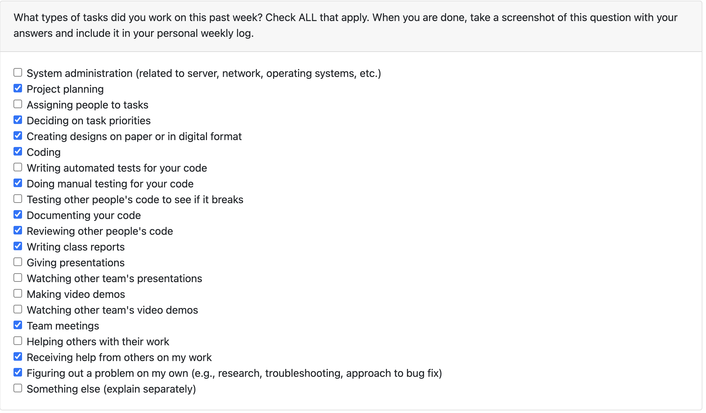

### Recap of Students Goals
<!--
- what tasks are you aiming to have completed by the end of the week
-->
- Implement the logic and user messages on the edit profile page (#125)
- Edit profile page documentation (#126)
- Edit profile page testing (#127)

### Student Tasks on Project Board
<!-- 
- Tasks undertaken on the project board
-->
1. Redo the profile page and reimplement the backend functionality (#121)
2. Start the settings page in the drawer to allow users to navigate to the edit profile page (#122)
3. Implement the front end of the edit profile page (#123)
4. Implement the backend functionality of the edit profile page (#124)
5. Implement the logic and user messages on the edit profile page (#125)
6. Profile page documentation (#50)
7. Edit profile page documentation (#126)
8. Edit profile page testing (#127)

### Which Tasks Are Completed vs. In Progress
<!--
- list of completed tasks
- list of tasks to be done
✓ x
-->

| Item # | Completed  | To Be Done |
|:------:|:-----------|:-----------|
|   1    |       ✓     |            |
|   2    |        ✓    |            |
|   3    |       ✓     |            |
|   4    |       ✓     |            |
|   5    |            |      ✓      |
|   6    |     ✓       |            |
|   7    |            |      ✓      |
|   8    |            |      ✓      |

### Work Period
<!-- 
- start/end dates of the week
-->
November 26 - December 4, 2023

### Individual Peer Evaluation
<!-- 
- screenshot of the weekly peer evaluation
-->
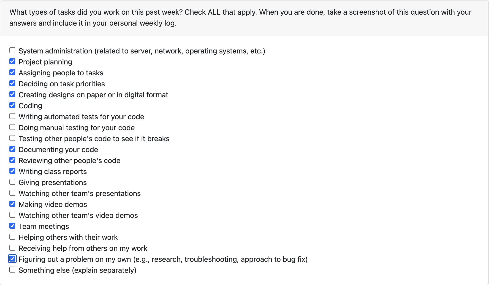

### Recap of Students Goals
<!--
- what tasks are you aiming to have completed by the end of the week
-->
- Design document
- Design Video
- Documentation
- Fixing up the edit profile page and other touch ups

### Student Tasks on Project Board
<!-- 
- Tasks undertaken on the project board
-->
- #136 - Design Document and Design Video
- #125 - Implement the logic and user messages on the edit profile page
- #137 - Add the map feature

### Which Tasks Are Completed vs. In Progress
<!--
- list of completed tasks
- list of tasks to be done
✓ x
-->

| Item # | Completed  | To Be Done |
|:------:|:-----------|:-----------|
|  136   | ✓          |            |
|  125   |            | ✓          |
|  137   |            | ✓          |

### Work Period
<!-- 
- start/end dates of the week
-->
January 7 - January 14, 2024

### Individual Peer Evaluation
<!-- 
- screenshot of the weekly peer evaluation
-->
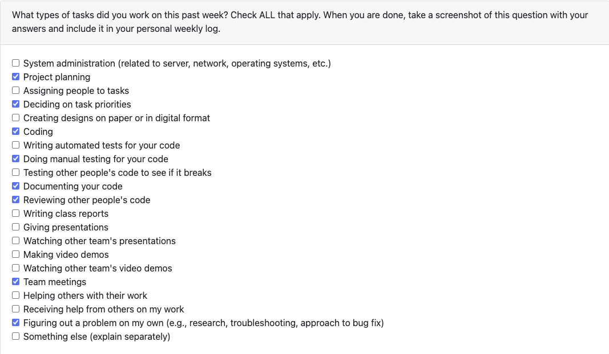

### Recap of Students Goals
<!--
- what tasks are you aiming to have completed by the end of the week
-->
- add more functionality to the map branch
- testing for the mapping feature

### Student Tasks on Project Board
<!-- 
- Tasks undertaken on the project board
-->
1. add the edit profile functionality
2. ensure settings page navigation to edit profiile works 
3. begin addition of the map feature 
4. add documentation for the edit profile and profile pages

### Which Tasks Are Completed vs. In Progress
<!--
- list of completed tasks
- list of tasks to be done
✓ x
-->

| Item # | Completed  | To Be Done |
|:------:|:-----------|:-----------|
| 1      |      ✓      |            |
| 2      |       ✓     |            |
| 3      |            |      ✓      |
| 4      |       ✓     |            |

# Team_Member_Name Log

### Work Period
<!-- 
- start/end dates of the week
-->
January 21 - 28 2024
### Individual Peer Evaluation
<!-- 
- screenshot of the weekly peer evaluation
-->
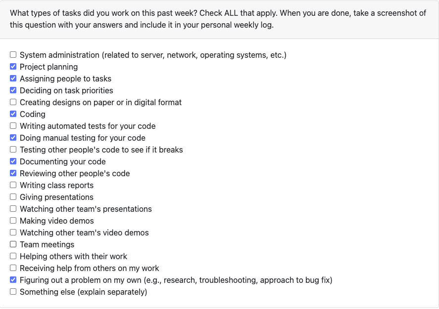

### Recap of Students Goals
<!--
- what tasks are you aiming to have completed by the end of the week
-->
- fix an issue where the map distance circle is not working on android
- find a way to link the sliders on the map and on the home page modal
- help implement the reviews function onto the profile page

### Student Tasks on Project Board
<!-- 
- Tasks undertaken on the project board
-->
- #21 link slider and modal on home page
- #20 calculate the distance from the users location to a post
- #183 fix issues that arose with the map on android
- #193 edit profile is not updating the profile page information
- #194 review stars having functionality issues

### Which Tasks Are Completed vs. In Progress
<!--
- list of completed tasks
- list of tasks to be done
✓ x
-->

| Item # |  Completed  |  To Be Done  |
|:------:|:-----------:|:------------:|
|   21   |             |      ✓       |
|   20   |             |      ✓       |
|  183   |             |      ✓       |
|  193   |      ✓      |              |
|  194   |      ✓      |              |

# Team_Member_Name Log

### Work Period
<!-- 
- start/end dates of the week
-->
January 28 - Feb 4 2024

### Individual Peer Evaluation
<!-- 
- screenshot of the weekly peer evaluation
-->

### Recap of Students Goals
<!--
- what tasks are you aiming to have completed by the end of the week
-->
- #20
- #21
- #183
- #232
- please see below for what these refer to on project board

### Student Tasks on Project Board
<!-- 
- Tasks undertaken on the project board
-->
- #208 change the rating system to match post page
- #206 when saving edit profile details, should provide success message or revert user back to home screen
- #203 edit details input fields sometimes delete or revert to blank despite correct format
- #202 cant scroll and keyboard blocks edit profile fields
- #20 calculate distance from location to post
- #21 link slider and radius modal on home page
- #183 fix issue where map features are not showing up on android
- #232 add character limits in the edit profile page

### Which Tasks Are Completed vs. In Progress
<!--
- list of completed tasks
- list of tasks to be done
✓ x
-->

| Item # | Completed  | To Be Done  |
|:------:|:----------:|:-----------:|
|  208   |     ✓      |             |
|  206   |     ✓      |             |
|  203   |     ✓      |             |
|  202   |     ✓      |             |
|   20   |            |      ✓      |
|   21   |            |      ✓      |
|  183   |            |      ✓      |
|  232   |            |      ✓      |

### Work Period
<!-- 
- start/end dates of the week
-->
February 4 - February 11 2024

### Individual Peer Evaluation
<!-- 
- screenshot of the weekly peer evaluation
-->
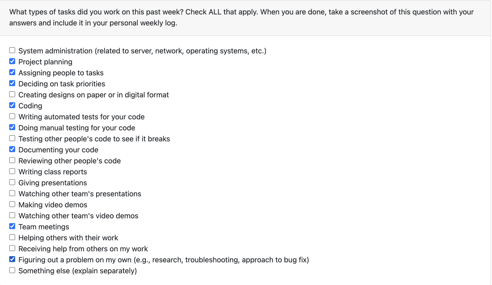

### Recap of Students Goals
<!--
- what tasks are you aiming to have completed by the end of the week
-->
- make the edit profile page look more similar to the rest of the pages #248
- move map feature to the bottom of the pages #246

### Student Tasks on Project Board
<!-- 
- Tasks undertaken on the project board
-->
- link slider and radius modal on home page #21
- calculate distance from your location to a post' #20
- fix issue where map features are not showing up on android #183
- move map feature to the bottom of the pages #246
- add more functionality to the map page #247
- make the edit profile page look more similar to the rest of the pages #248

### Which Tasks Are Completed vs. In Progress
<!--
- list of completed tasks
- list of tasks to be done
✓ x
-->

| Item # | Completed  | To Be Done |
|:------:|:----------:|:----------:|
|   21   |     ✓      |            |
|   20   |     ✓      |            |
|  183   |     ✓      |            |
|   246  |            |     ✓      |
|   247   |            |   ✓        |
|   248     |            |     ✓      |

# Team_Member_Name Log

### Work Period
<!-- 
- start/end dates of the week
-->
February 11 - 18 2024

### Individual Peer Evaluation
<!-- 
- screenshot of the weekly peer evaluation
-->
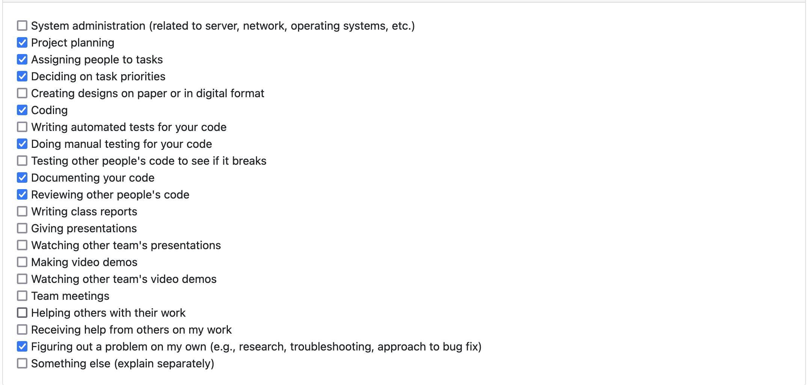

### Recap of Students Goals
<!--
- what tasks are you aiming to have completed by the end of the week
-->
- make the edit profile page look more similar to the rest of the pages #248
- add more functionality to the map page #247
- link slider and radius modal on home page #21
- calculate distance from your location to a post #20
- move map feature to the bottom of the pages #246

### Student Tasks on Project Board
<!-- 
- Tasks undertaken on the project board
-->
- move map feature to the bottom of the pages #246
- calculate distance from your location to a post #20
- link slider and radius modal on home page #21
- add more functionality to the map page #247
- make the edit profile page look more similar to the rest of the pages #248

### Which Tasks Are Completed vs. In Progress
<!--
- list of completed tasks
- list of tasks to be done
✓ x
-->

| Item # | Completed | To Be Done |
|:------:|:----------|:-----------|
|    #246    |           |      ✓      |
|    #20    |           |      ✓      |
|    #21    |           |      ✓      |
|    #247    |           |     ✓       |
|    #248    |           |     ✓       |

### Work Period
<!-- 
- start/end dates of the week
-->
February 18 - March 3, 2024

### Individual Peer Evaluation
<!-- 
- screenshot of the weekly peer evaluation
-->
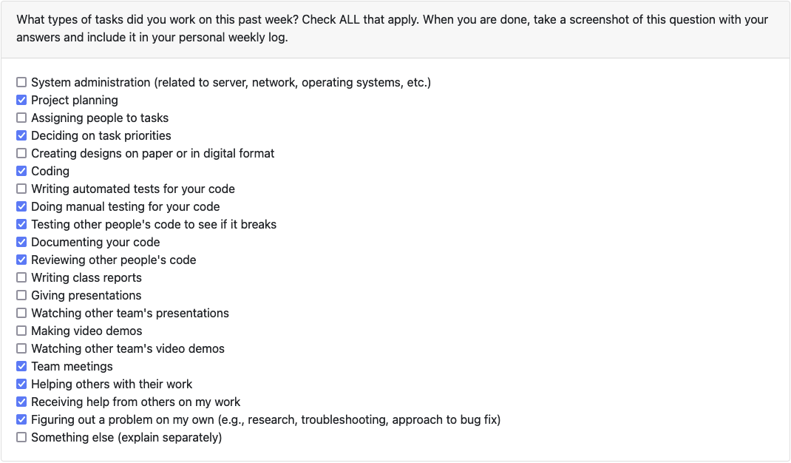

### Recap of Students Goals
<!--
- what tasks are you aiming to have completed by the end of the week
-->
- make the location services more modular #270
- add maxLength to the edit profile fields #269
- maybe: put pins on the map #266
- calculate distance from post to user #265

### Student Tasks on Project Board
<!-- 
- Tasks undertaken on the project board
-->
- make the location services more modular #270
- add maxLength to the edit profile fields #269
- maybe: put pins on the map #266
- calculate distance from post to user #265
- link slider and radius modal on home page #21
- add more functionality to the map page #247
- make the edit profile page look more similar to the rest of the pages #248
- move map feature to the bottom of the pages #246

### Which Tasks Are Completed vs. In Progress
<!--
- list of completed tasks
- list of tasks to be done
✓ x
-->

| Item # | Completed  | To Be Done  |
|:------:|:----------:|:-----------:|
|  246   |     ✓      |             |
|  248   |     ✓      |             |
|  247   |     ✓      |             |
|   21   |     ✓      |             |
|  265   |            |      ✓      |
|  266   |            |      ✓      |
|  269   |            |      ✓      |
|  270   |            |      ✓      |

# Team_Member_Name Log

### Work Period
<!-- 
- start/end dates of the week
-->
March 3 - March 10, 2024

### Individual Peer Evaluation
<!-- 
- screenshot of the weekly peer evaluation
-->
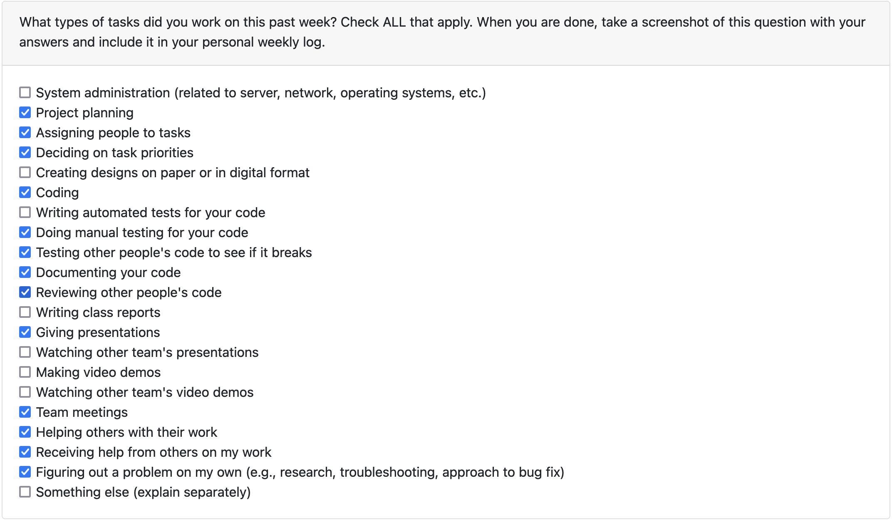

### Recap of Students Goals
<!--
- what tasks are you aiming to have completed by the end of the week
-->
- find a way to ensure that the user can re-enable the location services if declined at first #281
- put pins on the map #266
- fixing any issues from peer testing
- making sure everything was working properly for peer testing

### Student Tasks on Project Board
<!-- 
- Tasks undertaken on the project board
-->
- make the location services more modular #270
- put pins on the map #266
- calculate distance from post to user #265
- find a way to ensure that the user can renable the location services if declined at first #281

### Which Tasks Are Completed vs. In Progress
<!--
- list of completed tasks
- list of tasks to be done
✓ x
-->

| Item # | Completed  | To Be Done  |
|:------:|:----------:|:-----------:|
|  270   |      ✓      |             |
|  266   |            |      ✓       |
|  265   |     ✓       |             |
|  281   |            |      ✓       |

** there was a lot of bugs that needed to be fixed before peer testing this week and there is no note of this on github as they were often hotfixes

### Work Period
<!-- 
- start/end dates of the week
-->
March 10 - March 17, 2024

** was no a super busy week as we are nearing completion and are busy with other class projects **

### Individual Peer Evaluation
<!-- 
- screenshot of the weekly peer evaluation
-->

### Recap of Students Goals
<!--
- what tasks are you aiming to have completed by the end of the week
-->
- find a way to ensure that the user can re-enable the location services if declined at first #281
- put pins on the map #266

### Student Tasks on Project Board
<!-- 
- Tasks undertaken on the project board
-->
- find a way to ensure that the user can re-enable the location services if declined at first #281
- put pins on the map/create pin #266

### Which Tasks Are Completed vs. In Progress
<!--
- list of completed tasks
- list of tasks to be done
✓ x
-->

| Item # | Completed  | To Be Done  |
|:------:|:----------:|:-----------:|
|  266   |      ✓       |             |
|  281   |            |      ✓        |

