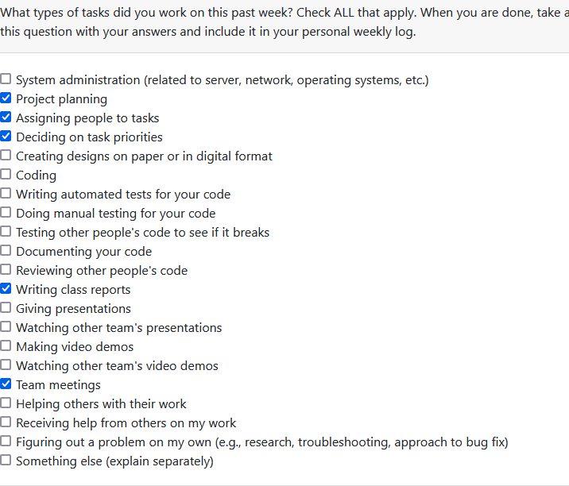
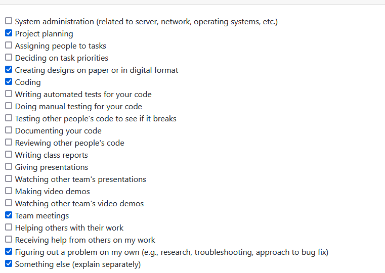

# Weekly Personal Log - Joss White

### Date Range
 - September 25 - October 1, 2023

### Task Types

### Weekly Goals
- Continue working with team to finsih up project plan
- Work on milestones and wrap our heads around scope
- Get set up and settled with tech stack

#### Individual goals:
- Contribute to team goals 
- Work on projet plan with team
- Creating milestone dates
- Discussing and refining features
- Talk about strengths and weaknesses of members
- Set up tech stack on personal machine

### Features
- Project Plan

### Date Range
 - October 1 - October 8, 2023

### Task Types

### Weekly Goals
- Set up tech stack. Figure out how to ste up a REST api backend using django and tie in a react native front end
- Create a figma group and start thinking about project design.
- Continue with project planning and idea communication

#### Individual goals:
- Contribute to team goals 
- Work on projet plan with team
- Tech stack set up on personal device
- Discussing and refining features
- Create a figma project for the team so we can start a mockup

### Features
- Project Plan (complete)
- Paper prototype/ Figma design (early stages)
  

