# Weekly Personal Log - Joss White

### Date Range
 - September 25 - October 1, 2023

### Task Types

### Weekly Goals
- Continue working with team to finsih up project plan
- Work on milestones and wrap our heads around scope
- Get set up and settled with tech stack

#### Individual goals:
- Contribute to team goals 
- Work on projet plan with team
- Creating milestone dates
- Discussing and refining features
- Talk about strengths and weaknesses of members
- Set up tech stack on personal machine

### Features
- Project Plan

### Date Range
 - October 1 - October 8, 2023

### Task Types

### Weekly Goals
- Set up tech stack. Figure out how to ste up a REST api backend using django and tie in a react native front end
- Create a figma group and start thinking about project design.
- Continue with project planning and idea communication

#### Individual goals:
- Contribute to team goals 
- Work on projet plan with team
- Tech stack set up on personal device
- Discussing and refining features
- Create a figma project for the team so we can start a mockup

### Features
- Project Plan (complete)
- Paper prototype/ Figma design (early stages)
  

### Work Period
 - October 9 - October 22, 2023

### Individual Peer Evaluation
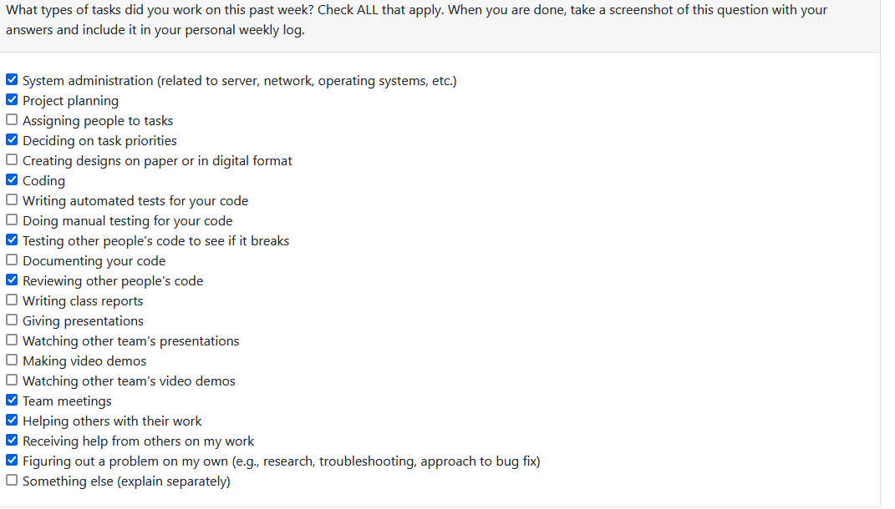

### Recap of Students Goals
<!--
- what tasks are you aiming to have completed by the end of the week
-->
- Work to catch up on teammates progress and learn Django Rest Framework
- Work towards team goals
- Work on Mac with backend setup
- Research into suitable map API
- Work on sign up and login page

### Student Tasks on Project Board
<!-- 
- Tasks undertaken on the project board
-->
- item#1 Configure our Django authentication portal with React Native Login/Signup page
- item#2 Create user authentication login/signup using the Django authentication library
- item#3 User testing

### Which Tasks Are Completed vs. In Progress
<!--
- list of completed tasks
- list of tasks to be done
✓ x
-->

| Item # | Completed | To Be Done |
|:------:|:----------|:-----------|
|   1    |           |     ✓      |
|   2    | ✓         |            |
|   3    |           | ✓          |

### Work Period
 - October 23 - October 29, 2023

### Individual Peer Evaluation
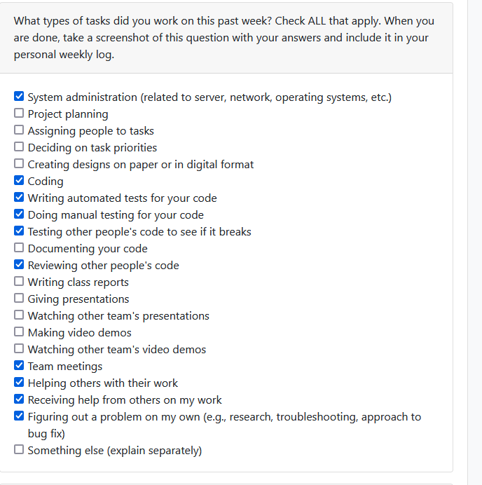

### Recap of Students Goals
<!--
- what tasks are you aiming to have completed by the end of the week
-->
- Continue progress towards the user profile
- Refine token and session logic in backend
- Establish suitable routing on the Front-end
- Refactor sign in code with Mac
- research map api 
  

### Student Tasks on Project Board
<!-- 
- Tasks undertaken on the project board
-->
- item#16 Configure our Django authentication portal with React Native Login/Signup page
- item#14 Create user authentication login/signup using the Django authentication library
- item#43 Update user model for profile information
- item#57 Update Django View and Serializer for for User
- item#56 Implement user details page

### Which Tasks Are Completed vs. In Progress
<!--
- list of completed tasks
- list of tasks to be done
✓ x
-->

| Item # | Completed | To Be Done |
|:------:|:----------|:-----------|
|   1    |      ✓      |          |
|   2    | ✓         |            |
|   3    |    ✓         |        |
|   4    |      ✓       |         |
|   5    |      ✓      |          |

### Work Period
 - October 30 - November 5, 2023

### Individual Peer Evaluation
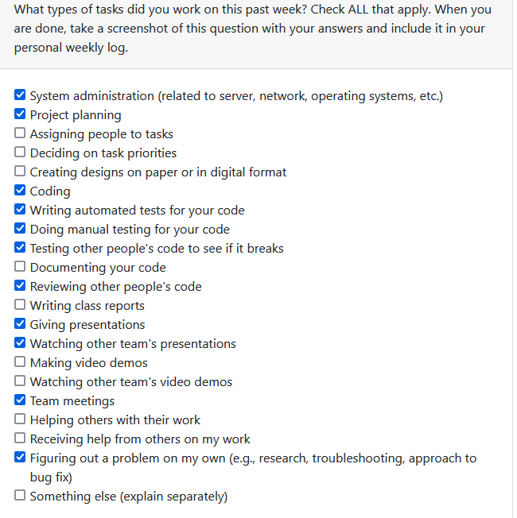

### Recap of Students Goals
<!--
- what tasks are you aiming to have completed by the end of the week
-->
- Implement backend functionality for profile page
- Refine token and session logic in backend
- Refactor authentication and token storage with Mac
- research map api
- research MySQL implementation
  

### Student Tasks on Project Board
<!-- 
- Tasks undertaken on the project board
-->
- item#16 Configure our Django authentication portal with React Native Login/Signup page
- item#14 Create user authentication login/signup using the Django authentication library
- item#43 Update user model for profile information
- item#57 Update Django View and Serializer for for User
- item#56 Implement user details page
- item#79 Backend implementation for profile page
- item#66 integrate MySQL database
- item#65 work on design doc
- item#57 update Django view and serializer for user
- item#56 implement user details page backend logic

### Which Tasks Are Completed vs. In Progress
<!--
- list of completed tasks
- list of tasks to be done
✓ x
-->

| Item # | Completed | To Be Done |
|:------:|:----------|:-----------|
|   1    |      ✓      |          |
|   2    | ✓         |            |
|   3    |    ✓         |        |
|   4    |      ✓       |         |
|   5    |      ✓      |          |
|   6   |           |      ✓     |
|   7   |          |      ✓      |
|   8  |           |     ✓      |
|   9   |      ✓      |          |
|   10   |      ✓      |          |

### Work Period
 - November 6 - November 13, 2023

### Individual Peer Evaluation

### Recap of Students Goals
<!--
- what tasks are you aiming to have completed by the end of the week
-->
- Configure Expo Go (Testing on mobile)
- Fix network related issues with connecting to backend
- Implement backend functionality for profile page
- Refine token and session logic in backend
- research map api
- research MySQL implementation
  

### Student Tasks on Project Board
<!-- 
- Tasks undertaken on the project board
-->
- item#16 Configure our Django authentication portal with React Native Login/Signup page
- item#14 Create user authentication login/signup using the Django authentication library
- item#43 Update user model for profile information
- item#57 Update Django View and Serializer for for User
- item#56 Implement user details page
- item#79 Backend implementation for profile page
- item#66 integrate MySQL database
- item#65 work on design doc
- item#57 update Django view and serializer for user
- item#56 implement user details page backend logic
- item#94 Configure DRF with Expo GO mobile environment

### Which Tasks Are Completed vs. In Progress
<!--
- list of completed tasks
- list of tasks to be done
✓ x
-->

| Item # | Completed | To Be Done |
|:------:|:----------|:-----------|
|   1    |      ✓      |          |
|   2    | ✓         |            |
|   3    |    ✓         |        |
|   4    |      ✓       |         |
|   5    |      ✓      |          |
|   6   |           |      ✓     |
|   7   |          |      ✓      |
|   8  |           |     ✓      |
|   9   |           |     ✓      |
|   10   |      ✓      |          |
|   11  |          |     ✓      |

### Work Period
 - November 14 - November 27, 2023

### Individual Peer Evaluation
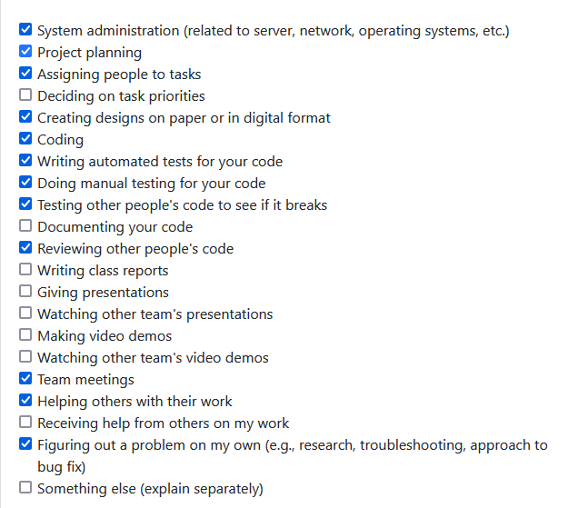

### Recap of Students Goals
<!--
- what tasks are you aiming to have completed by the end of the week
-->
- Frogot password feature
- Email verification
- Assist in moving edit deatisl to settings page (where applicable)
- Design document and video with team
- research MySQL implementation
- Configuration file
- Configure Expo go with backend
  

### Student Tasks on Project Board
<!-- 
- Tasks undertaken on the project board
-->
- item#16 Configure our Django authentication portal with React Native Login/Signup page
- item#14 Create user authentication login/signup using the Django authentication library
- item#43 Update user model for profile information
- item#57 Update Django View and Serializer for for User
- item#56 Implement user details page
- item#79 Backend implementation for profile page
- item#66 integrate MySQL database
- item#65 work on design doc
- item#57 update Django view and serializer for user
- item#56 implement user details page backend logic
- item#94 Configure DRF with Expo GO mobile environment
- item#78 Edit profile page backend
- item#109 Forgot password testing
- item#129 Forgot password api endpoint configuration
- item#130 Forgot password sending external email
- item#131 Configure Expo Go with DRF
- item#132 Create config gile and IP getter

### Which Tasks Are Completed vs. In Progress
<!--
- list of completed tasks
- list of tasks to be done
✓ x
-->

| Item # | Completed | To Be Done |
|:------:|:----------|:-----------|
|   1    |      ✓      |          |
|   2    | ✓         |            |
|   3    |    ✓         |        |
|   4    |      ✓       |         |
|   5    |      ✓      |          |
|   6   |           |      ✓     |
|   7   |          |      ✓      |
|   8  |           |     ✓      |
|   9   |           |     ✓      |
|   10   |      ✓      |          |
|   11  |          |     ✓      |
|   12  |          |     ✓      |
|   13  |       ✓     |         |
|   14  |          |     ✓      |
|   15  |          |     ✓      |
|   16  |       ✓    |           |
|   17  |       ✓    |          |

### Work Period
 - November 27 - December 3, 2023

### Individual Peer Evaluation
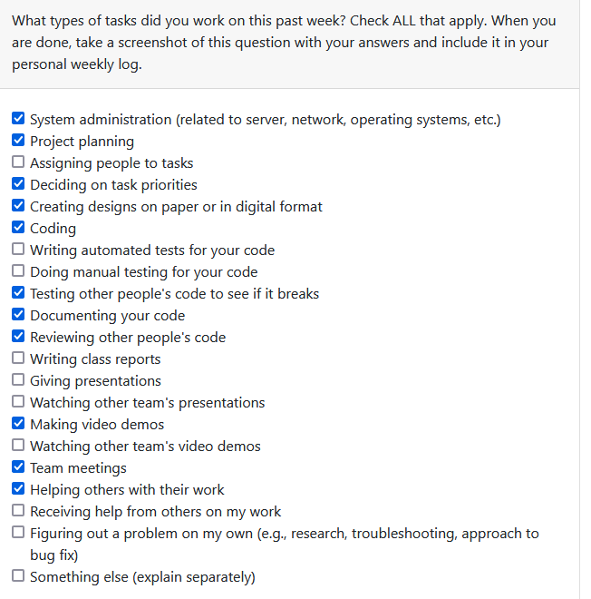

### Recap of Students Goals
<!--
- what tasks are you aiming to have completed by the end of the week
-->
- Frogot password feature
- Email verification
- Design document and video with team
- Research map api with Brandon
- Fix signup warning on Expo with Mac

### Student Tasks on Project Board
<!-- 
- Tasks undertaken on the project board
-->
- item#79 Backend implementation for profile page
- item#66 integrate MySQL database
- item#109 Forgot password testing
- item#129 Forgot password api endpoint configuration
- item#130 Forgot password sending external email
- item#135 Automated testing with GitHub issues
- item#137 Add map feature (this will be broken down into subtasks)

### Which Tasks Are Completed vs. In Progress
<!--
- list of completed tasks
- list of tasks to be done
✓ x
-->

| Item # | Completed | To Be Done |
|:------:|:----------|:-----------|
|   1    |      ✓      |          |
|   2    |        |        ✓        |
|   3    |     ✓     |           |
|   4    |           |      ✓       |
|   5    |           |      ✓        |
|   6   |           |      ✓     |
|   7   |          |      ✓      |

### Work Period
 - January 6 - December 14, 2024

### Individual Peer Evaluation
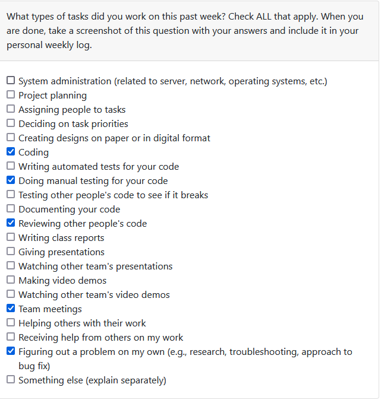

### Recap of Students Goals
<!--
- what tasks are you aiming to have completed by the end of the week
-->
- Frogot password feature
- -Universal email sending (currently restricted to gmail)

### Student Tasks on Project Board
<!-- 
- Tasks undertaken on the project board
-->
- item#79 Backend implementation for profile page
- item#66 integrate MySQL database
- item#109 Forgot password testing
- item#129 Forgot password api endpoint configuration
- item#130 Forgot password sending external email
- item#135 Automated testing with GitHub issues
- item#148 Increase and test security measures of current forgot password implementation
- item#146 Allow for any email provider to recieve forgot password code using sendgrid api
- item#147 clean up map api

### Which Tasks Are Completed vs. In Progress
<!--
- list of completed tasks
- list of tasks to be done
✓ x
-->

| Item # | Completed | To Be Done |
|:------:|:----------|:-----------|
|   1    |      ✓      |          |
|   2    |        |        ✓        |
|   3    |     ✓     |           |
|   4    |        ✓     |           |
|   5    |        ✓     |            |
|   6   |           |      ✓     |
|   7   |           |      ✓     |
|   8   |           |      ✓     |
|   9  |           |      ✓     |

### Work Period
 - January 15 - January 21, 2024

### Individual Peer Evaluation
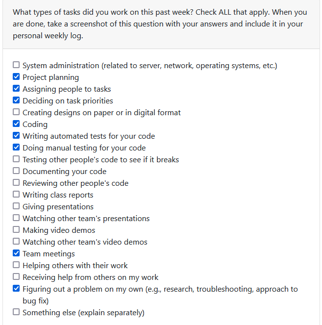

### Recap of Students Goals
<!--
- what tasks are you aiming to have completed by the end of the week
-->
- Forgot password feature
- Universal email sending (currently restricted to gmail)
- Forgot password UI and flow optimization
- Begin and research chat feature
- Change password feature within profile page

### Student Tasks on Project Board
<!-- 
- Tasks undertaken on the project board
-->
- item#109 Forgot password testing
- item#129 Forgot password api endpoint configuration
- item#148 Increase and test security measures of current forgot password implementation
- item#146 Allow for any email provider to recieve forgot password code using sendgrid api
- item#130 Forgot password sending external email
- item#164 Chat serializers for user messages
- item#163 Create chat model
- item#162 Change password in Profile page
- item#165 API View for chat operations
- item#165 Chat components (FE) and API calls
- item#165 Chat API tests
- item#135 Automated testing with GitHub issues

### Which Tasks Are Completed vs. In Progress
<!--
- list of completed tasks
- list of tasks to be done
✓ x
-->

| Item # | Completed | To Be Done |
|:------:|:----------|:-----------|
|   1    |      ✓      |          |
|   2    |       ✓     |            |
|   3    |     ✓     |           |
|   4    |        ✓     |           |
|   5    |        ✓     |            |
|   6   |     ✓       |          |
|   7   |       ✓       |        |
|   8   |           |      ✓     |
|   9  |           |      ✓     |
|   10  |           |      ✓     |
|   11 |           |      ✓     |
|   12   |           |      ✓     |
### Work Period
 - January 22 - January 28, 2024

### Individual Peer Evaluation
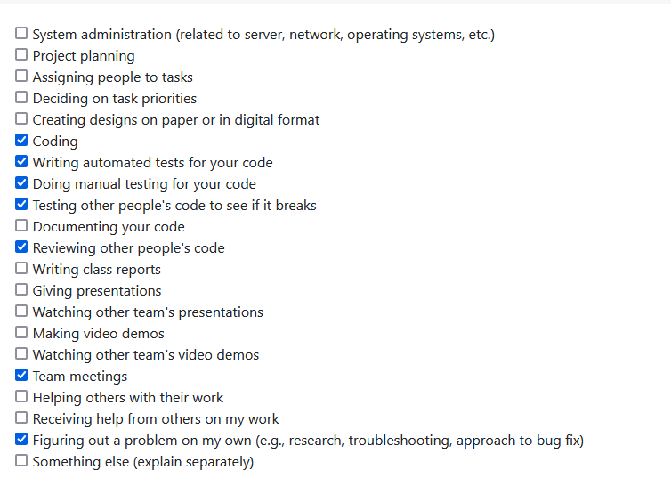

### Recap of Students Goals
<!--
- what tasks are you aiming to have completed by the end of the week
-->
- Initiate chat instance between sender and receiver from Product details page
- Create chat list within chat page
- More chat tests
- Change password feature within profile page

### Student Tasks on Project Board
<!-- 
- Tasks undertaken on the project board
-->
- item#109 Forgot password testing
- item#129 Forgot password api endpoint configuration
- item#148 Increase and test security measures of current forgot password implementation
- item#146 Allow for any email provider to recieve forgot password code using sendgrid api
- item#130 Forgot password sending external email
- item#164 Chat serializers for user messages
- item#163 Create chat model
- item#162 Change password in Profile page
- item#165 API View for chat operations
- item#165 Chat components (FE) and API calls
- item#165 Chat API tests
- item#187 Initiate chat instance between sender and receiver from Product details page
- item#186 Create chat list within chat page
- item#135 Automated testing with GitHub issues

### Which Tasks Are Completed vs. In Progress
<!--
- list of completed tasks
- list of tasks to be done
✓ x
-->

| Item # | Completed | To Be Done |
|:------:|:----------|:-----------|
|   1    |      ✓      |          |
|   2    |       ✓     |            |
|   3    |     ✓     |           |
|   4    |        ✓     |           |
|   5    |        ✓     |            |
|   6   |     ✓       |          |
|   7   |       ✓       |        |
|   8   |           |      ✓     |
|   9  |        ✓      |        |
|   10  |       ✓      |         |
|   11 |           |      ✓     |
|   12   |           |      ✓     |
|   13 |           |      ✓     |
|   14  |           |      ✓     |

### Work Period
 - January 22 - January 28, 2024

### Individual Peer Evaluation
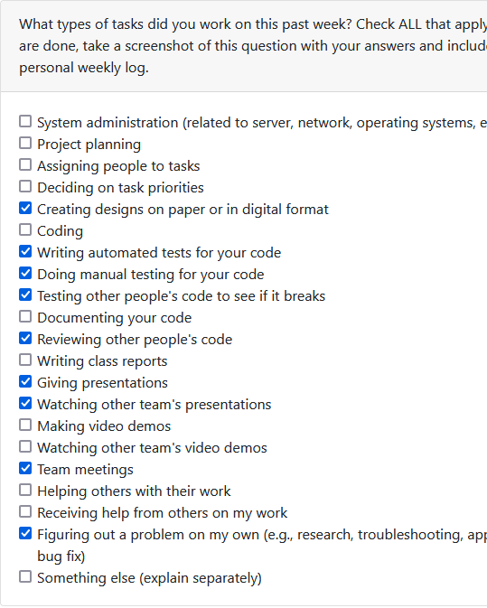

### Recap of Students Goals
<!--
- what tasks are you aiming to have completed by the end of the week
-->
- Prepare and test app for peer testing
- Identify week areas
- Chat architecture (paper design)
- Initiate chat instance between sender and receiver from Product details page
- Create chat list within chat page
- More chat tests
- Change password feature within profile page

### Student Tasks on Project Board
<!-- 
- Tasks undertaken on the project board
-->
- item#162 Change password in Profile page
- item#165 API View for chat operations
- item#165 Chat components (FE) and API calls
- item#165 Chat API tests
- item#187 Initiate chat instance between sender and receiver from Product details page
- item#186 Create chat list within chat page
- item#135 Automated testing with GitHub issues
- item#223 Edit details patch request bug fix
- item#201 Darker font on IOS/Expo Go form fields bug fix
- item#223 FE feedback forgot password

### Which Tasks Are Completed vs. In Progress
<!--
- list of completed tasks
- list of tasks to be done
✓ x
-->

| Item # | Completed | To Be Done |
|:------:|:----------|:-----------|
|   1   |           |      ✓     |
|   2  |             |      ✓   |
|   3  |           |     ✓      |
|   4 |           |      ✓     |
|   5   |           |      ✓     |
|   6 |           |      ✓     |
|   7  |           |      ✓     |
|   8 |          ✓      |         |
|   9  |          ✓      |         |
|   10  |           ✓     |      |

### Work Period
 - Feb 5 - Feb 11, 2024

### Individual Peer Evaluation
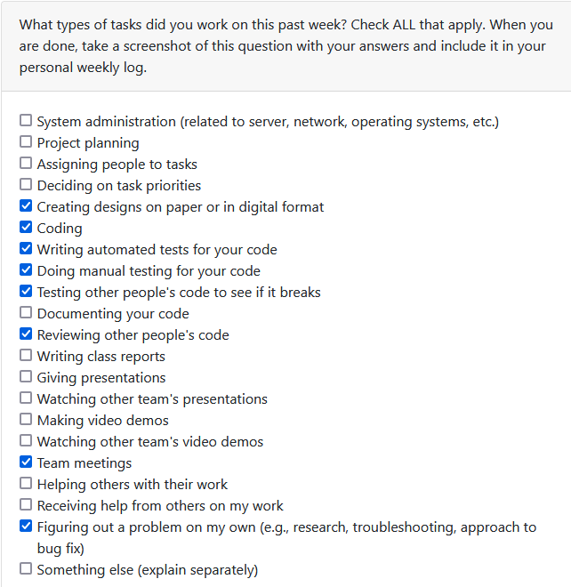

### Recap of Students Goals
<!--
- what tasks are you aiming to have completed by the end of the week
-->
- Chat architecture (paper design)
- Initiate chat instance between sender and receiver from Product details page
- Create chat list within chat page
- More chat tests
- Navigate to specific chat page from list of chats
- chat instance begins at post details screen
- create sepreate message model, many relation to chat list
- Clean up chat list an duser messages to display relevant formatted data
- deletion of chat if product as marked as picked up or deleted
- Change password feature within profile page

### Current Student Tasks on Project Board in progress
<!-- 
- Tasks undertaken on the project board
-->
- item#187 Initiate chat instance between sender and receiver from Product details page
- item#186 Create chat list within chat page
- item#236 Create seperate message model to allow many messgaes in chat list
- item#238 chat instance begins at post details screen
- item#239 nevigation to specific chat page from list of chats
- item#165 Chat API tests
- item#240 Clean up chat list and user messages
- item#235 deletion of chat if product is marked as picked up or deleted

### Which Tasks Are Completed vs. In Progress
<!--
- list of completed tasks
- list of tasks to be done
✓ x
-->

| Item # | Completed | To Be Done |
|:------:|:----------|:-----------|
|   1   |       ✓     |          |
|   2  |       ✓       |        |
|   3  |       ✓     |          |
|   4 |       ✓     |          |
|   5   |     ✓       |          |
|   6 |        ✓     |         |
|   7  |           |      ✓     |
|   8 |               |     ✓     |
|   9  |              |       ✓    |

### Work Period
 - Feb 5 - Feb 11, 2024

### Individual Peer Evaluation

### Recap of Students Goals
<!--
- what tasks are you aiming to have completed by the end of the week
-->
- Chat architecture (paper design)
- Initiate chat instance between sender and receiver from Product details page
- Create chat list within chat page
- More chat tests
- Navigate to specific chat page from list of chats
- chat instance begins at post details screen
- create sepreate message model, many relation to chat list
- Clean up chat list an duser messages to display relevant formatted data
- deletion of chat if product as marked as picked up or deleted
- Change password feature within profile page

### Current Student Tasks on Project Board in progress
<!-- 
- Tasks undertaken on the project board
-->
- item#187 Initiate chat instance between sender and receiver from Product details page
- item#186 Create chat list within chat page
- item#236 Create seperate message model to allow many messgaes in chat list
- item#238 chat instance begins at post details screen
- item#239 nevigation to specific chat page from list of chats
- item#165 Chat API tests
- item#240 Clean up chat list and user messages
- item#235 deletion of chat if product is marked as picked up or deleted
- item#259 Slide down refresh for chat updates
- item#260 Correctly sort sender and receiver of individual messages for formatting

### Which Tasks Are Completed vs. In Progress
<!--
- list of completed tasks
- list of tasks to be done
✓ x
-->

| Item # | Completed | To Be Done |
|:------:|:----------|:-----------|
|   1   |       ✓     |          |
|   2  |       ✓       |        |
|   3  |       ✓     |          |
|   4 |       ✓     |          |
|   5   |     ✓       |          |
|   6 |        ✓     |         |
|   7  |           |      ✓     |
|   8 |               |     ✓     |
|   9  |              |       ✓    |
|   10  |              |       ✓    |
|   11 |              |       ✓    |

### Work Period
 - Feb 24 - Mar 3, 2024

### Individual Peer Evaluation
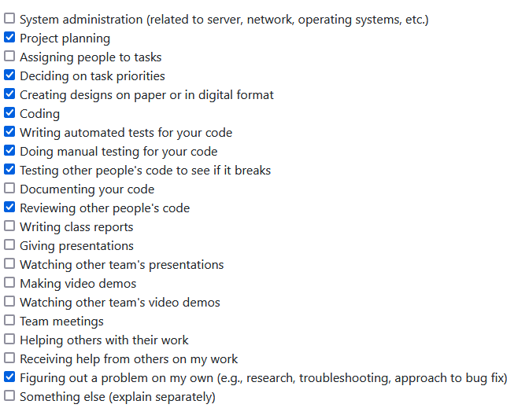

### Recap of Students Goals
<!--
- what tasks are you aiming to have completed by the end of the week
-->
- Chat dynamic refreshing
- Chat bug fixes
- Create chat list within chat page
- More chat tests
- Navigate to specific chat page from list of chats
- chat instance begins at post details screen
- create sepreate message model, many relation to chat list
- Clean up chat list an duser messages to display relevant formatted data
- deletion of chat if product as marked as picked up or deleted
- Change password feature within profile page

### Current Student Tasks on Project Board in progress
<!-- 
- Tasks undertaken on the project board
-->
- item#187 Initiate chat instance between sender and receiver from Product details page
- item#186 Create chat list within chat page
- item#236 Create seperate message model to allow many messgaes in chat list
- item#238 chat instance begins at post details screen
- item#239 nevigation to specific chat page from list of chats
- item#165 Chat API tests
- item#240 Clean up chat list and user messages
- item#235 deletion of chat if product is marked as picked up or deleted
- item#259 Slide down refresh for chat updates
- item#260 Correctly sort sender and receiver of individual messages for formatting
- item#275 Relevant user details on chat page

### Which Tasks Are Completed vs. In Progress
<!--
- list of completed tasks
- list of tasks to be done
✓ x
-->

| Item # | Completed | To Be Done |
|:------:|:----------|:-----------|
|   1   |       ✓     |          |
|   2  |       ✓       |        |
|   3  |       ✓     |          |
|   4 |       ✓     |          |
|   5   |     ✓       |          |
|   6 |        ✓     |         |
|   7  |           |      ✓     |
|   8 |           ✓       |       |
|   9  |              |       ✓    |
|   10  |       ✓         |         |
|   11 |         ✓       |         |
|   11 |             |       ✓     |
