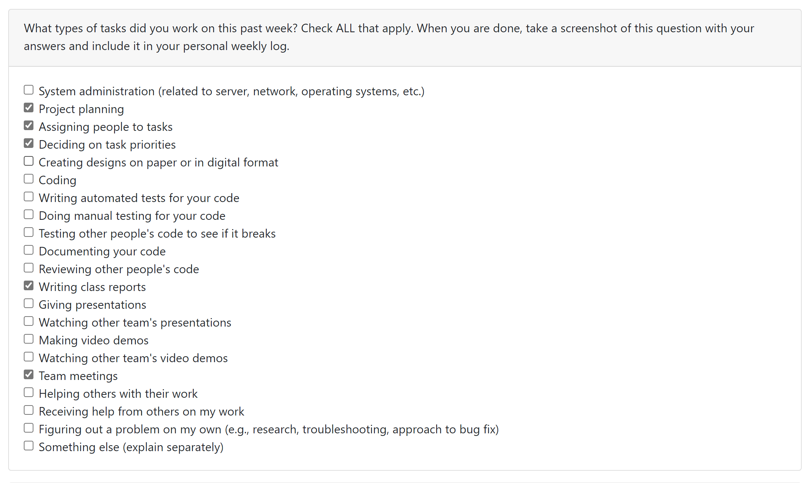

# Weekly Personal Log - Mackenzie Kudrenecky

### Date Range
 - September 25 - October 1, 2023

### Task Types

### Weekly Goals
- Get a solid overview of what we would like to accomplish in our app
- Decide on a tech stack and framework
- Complete the project plan - scoping, features, and division of labour
- Begin filling the knowledge gaps for our anticipated hurdles

#### Individual goals:
- Contribute to team goals 
- Get an introduction to the React Native
- Contribute to the project plan 
    - Bring ideas for features
    - Discuss strengths and shortcomings
    - Estimate milestone timelines 
- Maintain communication and provide timely contributions and feedback

### Features
- Project Plan
- Task associated with this feature: "Project Plan (#2)"
    - completed