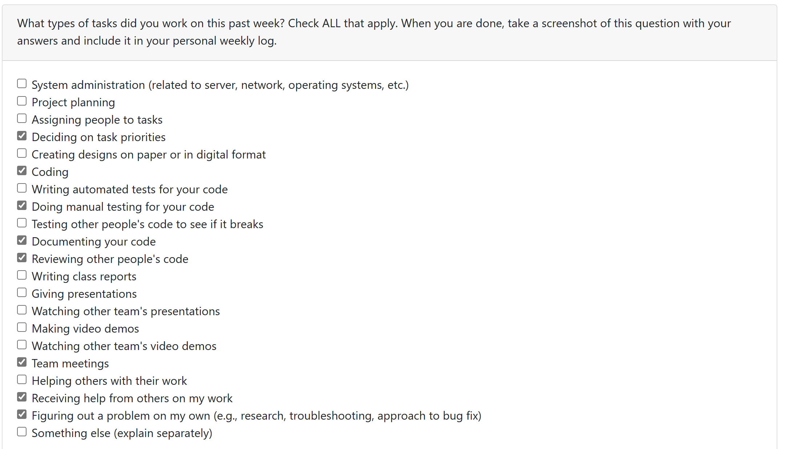
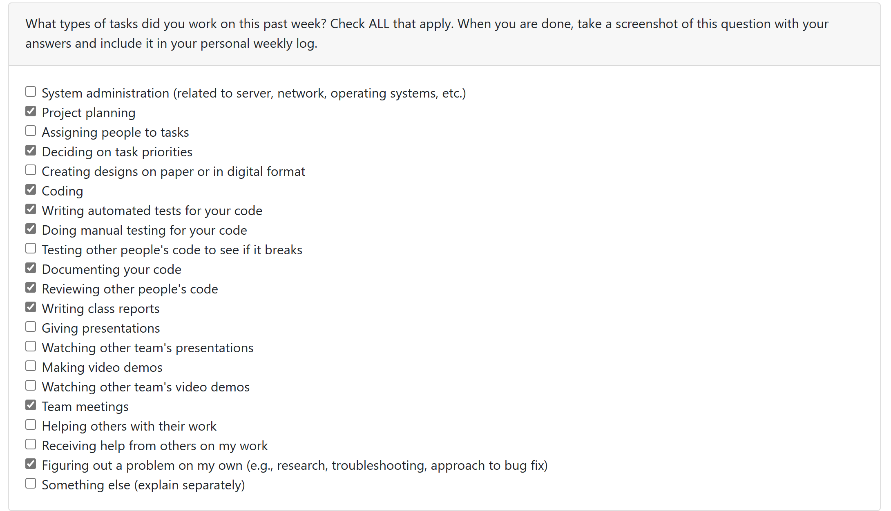
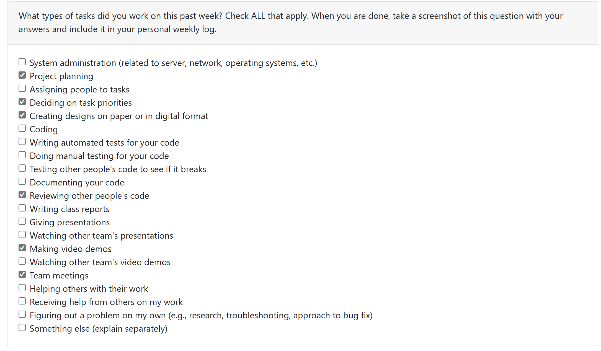
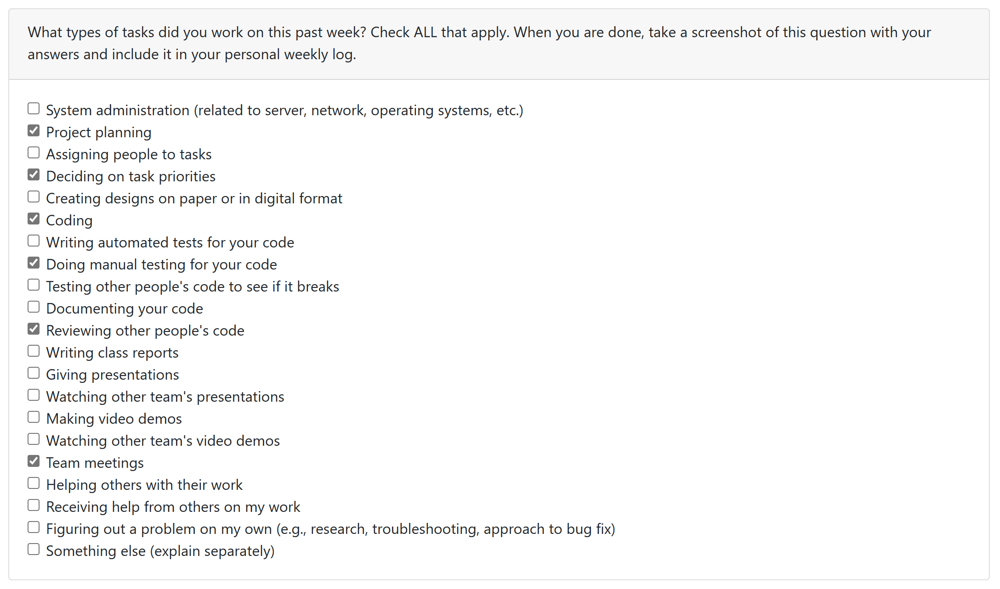
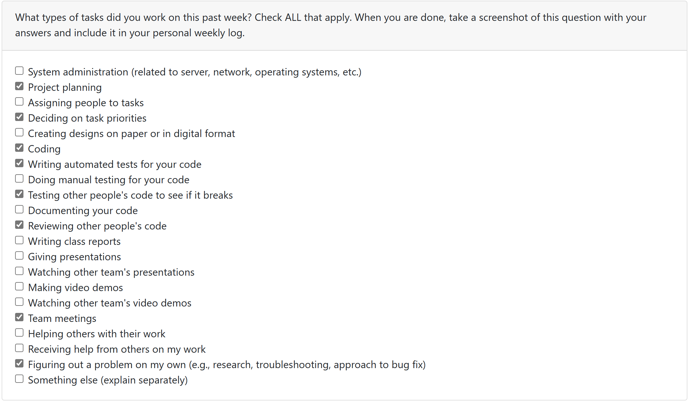
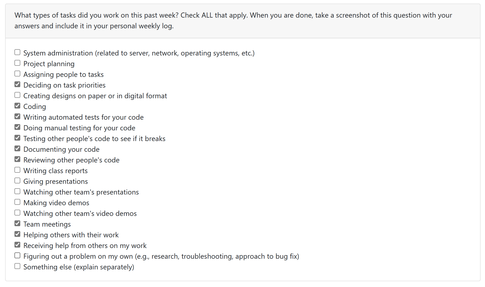
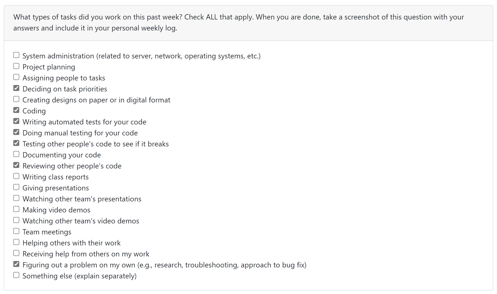
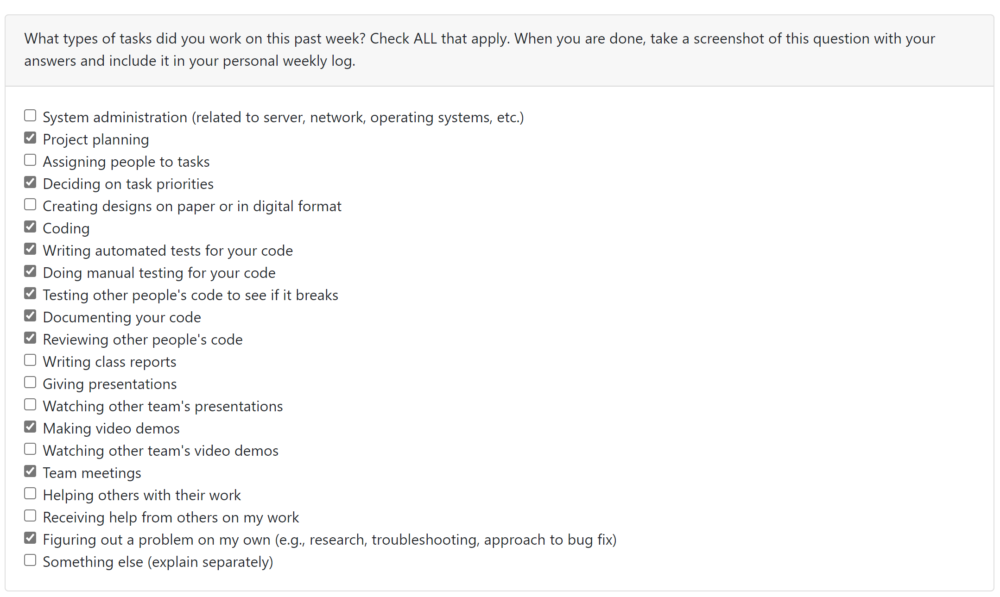
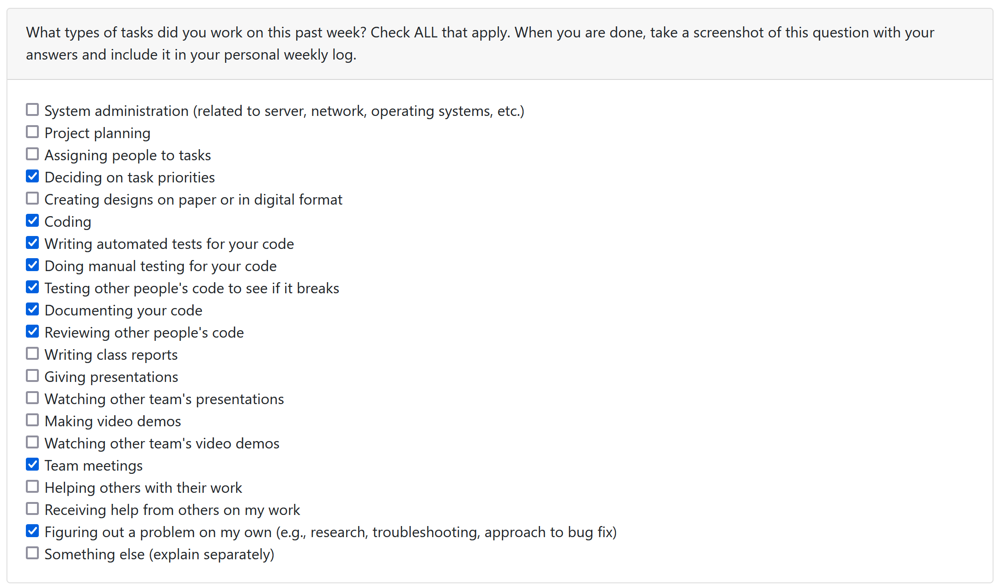

# Weekly Personal Log - Mackenzie Kudrenecky

### Date Range

- September 25 - October 1, 2023

### Task Types

### Weekly Goals

- Get a solid overview of what we would like to accomplish in our app
- Decide on a tech stack and framework
- Complete the project plan - scoping, features, and division of labour
- Begin filling the knowledge gaps for our anticipated hurdles

#### Individual goals:

- Contribute to team goals
- Get an introduction to the React Native
- Contribute to the project plan
  - Bring ideas for features
  - Discuss strengths and shortcomings
  - Estimate milestone timelines
- Maintain communication and provide timely contributions and feedback

### Features

- Project Plan
- Task associated with this feature: "Project Plan (#2)"
  - completed

### Work Period

- October 2 - 8, 2023

### Task Types

### Weekly Goals

- Explore the tech stack
- Set up development environment for Django and React Native
- Build test app - test environment to ensure the team's machines are working are ready to go
- Get started on Figma prototypes
- Start planning to code

#### Individual goals:

- Get an introduction to the Django Rest Frame work and React Native coupling
- Go through a test project development to set up environment and familiarize with process
- Start planning a login and home page
- Explore figma for more UI details
- Maintain communication and provide timely contributions and feedback

### Student Tasks on Project Board

<!--
- Tasks undertaken on the project board
-->

- item#1 set up project environment
- item#2 get figma up and running for design
- item#3 create mockups in figma for ui/ux
- item#4 begin paper prototyping
- item#5 user testing

### Which Tasks Are Completed vs. In Progress

<!--
- list of completed tasks
- list of tasks to be done
✓ x
-->

| Item # | Completed | To Be Done |
| :----: | :-------- | :--------- |
|   1    | ✓         |            |
|   2    | ✓         |            |
|   3    |           | ✓          |
|   4    |           | ✓          |
|   5    |           | ✓          |

### Work Period

<!--
- start/end dates of the week
-->

October 9 - 22, 2023

### Individual Peer Evaluation

<!--
- screenshot of the weekly peer evaluation
-->

### Recap of Students Goals

<!--
- what tasks are you aiming to have completed by the end of the week
-->

- Launch the backend in Django Rest Framework
- Create an API to authenticate users
- Create an API to create users
- Create a 'product' model to get an idea how we will store and display data
- Extend Django's built in User model class to have it fit our needs (ongoing)
- Refactor Django and JWT token authentication based on username to email
- Connect the front and back end -> run django and react servers and have the API consumed by the user interface
- Unit testing

### Student Tasks on Project Board

<!--
- Tasks undertaken on the project board
-->

- item 31 - user model unit tests
- item 32 - product view unit test
- item 33 - user views unit tests
- item 34 - create custom user model
- item 35 - token authentication api
- item 38 - create product model and views
- item 39 - user model views (crud)

### Which Tasks Are Completed vs. In Progress

<!--
- list of completed tasks
- list of tasks to be done
✓ x
-->

| Item # | Completed | To Be Done |
| :----: | :-------- | :--------- |
|   31   | ✓         |            |
|   32   | ✓         |            |
|   33   | ✓         |            |
|   34   | ✓         |            |
|   35   | ✓         |            |
|   38   | ✓         |            |
|   39   | ✓         |            |

### Work Period

<!--
- start/end dates of the week
-->

October 23 - 29, 2023

### Individual Peer Evaluation

<!--
- screenshot of the weekly peer evaluation
-->

### Recap of Students Goals

<!--
- what tasks are you aiming to have completed by the end of the week
-->

- Refine authorization
- Refactor API for jwt token authorizatoin
- Manage authentication in front end using Context
- Use context to manage state
- Implement logout and redirects if user is not authenticated
- Learn some front end (React Native) workflows

### Student Tasks on Project Board

<!--
- Tasks undertaken on the project board
-->

- item 49 - handle authentication in the front end
- task is ongoing but have made some solid progress. A few issues to debug

### Which Tasks Are Completed vs. In Progress

<!--
- list of completed tasks
- list of tasks to be done
✓ x
-->

| Item # | Completed | To Be Done |
| :----: | :-------- | :--------- |
|   49   |           | ✓          |

### Work Period

<!--
- start/end dates of the week
-->

October 30 - November 05, 2023

### Individual Peer Evaluation

<!--
- screenshot of the weekly peer evaluation
-->

### Recap of Students Goals

<!--
- what tasks are you aiming to have completed by the end of the week
-->

- Continue to refine authorization
- Manage authentication in front end using Context
- Handle JWT tokens in the front end
- Use context throughout the app the control state and authentication
- Refresh tokens on a time interval
- Check for tokens, log out user if tokens not valid
- Update ER diagram
- Update Architecture diagram
- Demo the app

### Student Tasks on Project Board

<!--
- Tasks undertaken on the project board
-->

- item 49 - handle authentication in the front end
- item 65 - design document
- item 64 - system architecture diagram
- item 63 - ER diagram - have a working prototype but is a living document and may change as our needs evolve

### Which Tasks Are Completed vs. In Progress

<!--
- list of completed tasks
- list of tasks to be done
✓ x
-->

| Item # | Completed | To Be Done |
| :----: | :-------- | :--------- |
|   49   | ✓         |            |
|   65   |           | ✓          |
|   64   |           | ✓          |
|   63   |           | ✓          |

### Work Period

<!--
- start/end dates of the week
-->

November 06 - November 12, 2023

### Individual Peer Evaluation

<!--
- screenshot of the weekly peer evaluation
-->

### Recap of Students Goals

<!--
- what tasks are you aiming to have completed by the end of the week
-->

- Implement search/filter functionality in backend
- Test functionality using postman + DRF Web
- Integrate backend API calls display data in front end - Profile page + logging data in homePage
- Refactor Product Model to store categories
- Refactor Product View for categorical filtering
- Implement logout and integrate into front-end
- Implement apiHelpers - a JS script for front-end consumption of backend. Can be used directly or as starter code for front-end to access database
- Continue working on Design Document

### Student Tasks on Project Board

<!--
- Tasks undertaken on the project board
-->

- issue #67 - extend product model - completed for current state of project - will continue to evolve
- issue #88 - api call for user data
- issue #89 - api call for product listing
- issue #84 - implement logout
- issue #83 - filtering backend

### Which Tasks Are Completed vs. In Progress

<!--
- list of completed tasks
- list of tasks to be done
✓ x
-->

| Item # | Completed | To Be Done |
| :----: | :-------- | :--------- |
|   67   | ✓         |            |
|   88   | ✓         |            |
|   89   | ✓         |            |
|   84   | ✓         |            |
|   83   | ✓         |            |

### Work Period

<!--
- start/end dates of the week
-->

November 13 - November 26, 2023

### Individual Peer Evaluation

<!--
- screenshot of the weekly peer evaluation
-->

!

### Recap of Students Goals

<!--
- what tasks are you aiming to have completed by the end of the week
-->

- refactor product model to connect users to products
- implement API endpoint to user's product list "my-products"
- integrate my-products into front end with API helpers function
- implement image model
- connect images to products
- test images implementation Postman
- implement search functionality in backend
- implement API helper function for search query to backend
- add best before date and accompanying valid flag on product model
- automate updated the flag based on current date each time product list endpoint is queried
- test cases for new functionality

### Student Tasks on Project Board

<!--
- Tasks undertaken on the project board
-->

- refactor Product model to link to User #86
- link products to Users API call #87
- integrate user-products into front-end #98
- test case for filtering #99
- test case for user owned products #100
- API call to user owned products #101
- Implement Search for title+content #110
- test cases for search functionality (backend) #111
- API helper function for search in front end #112
- Implement image storage for products backend #113
- API helper to post product (text only) #114
- API helper to make post with images #115
- Best before date and valid flag on product model #116
- functionality to update valid flag based on current date #117
- test cases for valid flag and best before #118

### Which Tasks Are Completed vs. In Progress

<!--
- list of completed tasks
- list of tasks to be done
✓ x
-->

| Item # | Completed | To Be Done |
| :----: | :-------- | :--------- |
|  ALL   | ✓         |            |

### Work Period

<!--
- start/end dates of the week
-->

November 27 - December 03, 2023

### Individual Peer Evaluation

<!--
- screenshot of the weekly peer evaluation
-->

### Recap of Students Goals

<!--
- what tasks are you aiming to have completed by the end of the week
-->

- contribute to design document
- refine ER diagram
- document design process for ER diagram

### Student Tasks on Project Board

<!--
- Tasks undertaken on the project board
-->

- #65 Design Document
-

### Which Tasks Are Completed vs. In Progress

<!--
- list of completed tasks
- list of tasks to be done
✓ x
-->

| Item # | Completed | To Be Done |
| :----: | :-------- | :--------- |
|   65   | ✓         |            |

### Work Period

<!--
- start/end dates of the week
-->

January 8, 2023 - January 14, 2023

### Individual Peer Evaluation

<!--
- screenshot of the weekly peer evaluation
-->

### Recap of Students Goals

<!--
- what tasks are you aiming to have completed by the end of the week
-->

- backend implementation for image storage and handling
- backend implementation linking images to product post
- front end implementation of function to create product post with image using API call
- postman testing of API (backend)
- refactor original front end code to shift from web to mobile image handling
- front end API call to create post without image -> testing endpoint before front end implementation of image field

### Student Tasks on Project Board

<!--
- Tasks undertaken on the project board
-->

- #151 front end image handling / post creation
- #115 API helper to make post with images
- #72 create images model
- #67 extend product model

** Work can be seen on feats/add_listing_fe_bk as changes are not ready to be merged to master! **

### Which Tasks Are Completed vs. In Progress

<!--
- list of completed tasks
- list of tasks to be done
✓ x
-->

| Item # | Completed | To Be Done |
| :----: | :-------- | :--------- |
|  151   | ✓         |            |
|   72   | ✓         |            |
|  115   | ✓         |            |
|   67   | ✓         |            |

### Work Period

<!--
- start/end dates of the week
-->

January 15, 2023 - January 21, 2023

### Individual Peer Evaluation

<!--
- screenshot of the weekly peer evaluation
-->

### Recap of Students Goals

<!--
- what tasks are you aiming to have completed by the end of the week
-->

- image handling!
- backend unit testing for image upload
- front end refactor to handle images in mobile
- display posting text fields in front end
- display post images in front end

## Roadblocks

It turns out not to be trivial to deal with images in a mobile app.

- react native needs image paths to be static -> ready at compile time
- this makes is hard to post images, create new paths, and display
- the solution seems to be using uri, I have yet to be successful using uri
- I have been able to hard code paths to images in to ensure it can be displayed but this too is problematic -> currently experiencing the hard coded images displaying randomly (or the reason is not yet obvious to me)
-

### Student Tasks on Project Board

<!--
- Tasks undertaken on the project board
-->

- #156 Display posts in home page
- #168 Home Page refactor for fetched data
- #115 API helper to make post with images
- #171 display text fields for posting (front end)
- #172 dynamic rendering of images for posts (front end)
- #173 listing refactor for fetched data (front end)
- #174 add admin view for products (backend)
- #175 add allergens field on product model (backend)
- api refactors

** Work can be seen on feats/add_listing_fe_bk as changes are not ready to be merged to master! **

### Which Tasks Are Completed vs. In Progress

<!--
- list of completed tasks
- list of tasks to be done
✓ x
-->

| Item # | Completed | To Be Done |
| :----: | :-------- | :--------- |
|  168   | ✓         |            |
|  115   | ✓         |            |
|  171   | ✓         |            |
|  172   |           | ✓          |
|  173   | ✓         |            |
|  174   | ✓         |            |
|  175   | ✓         |            |
|        |           |            |

### Work Period

<!--
- start/end dates of the week
-->

January 22, 2023 - January 28, 2023

### Individual Peer Evaluation

<!--
- screenshot of the weekly peer evaluation
-->

### Recap of Students Goals

<!--
- what tasks are you aiming to have completed by the end of the week
-->

- [x] image handling!
- [x] front end refactor to handle images in mobile
- [x] display post images in front end
- [x] create review model
- [x] link reviews to users by giver and receiver
- [x] create API endpoints for Review CRUD
- [x] test the API in isolation (POSTMAN) / DRF gui
- [x] unit testing for Review
- [x] add function to auto update user rating when new review is received
- [x] permissions refactor to allow access of user data -> populates fields such as rating, name, etc on posts.
- [x] create global app state context - handles updated data, flags app to re-render when new data comes in. For example, when a new post is made, the homepage will re-render will the new post.
- [x] add review model to admin view for gui interaction

### Student Tasks on Project Board

<!--
- Tasks undertaken on the project board
-->

- [x] [#190](https://github.com/COSC-499-W2023/year-long-project-team-8/issues/190)
- [ ] [#195](https://github.com/COSC-499-W2023/year-long-project-team-8/issues/195)
- [x] [#172](https://github.com/COSC-499-W2023/year-long-project-team-8/issues/172)
- [x] [#180](https://github.com/COSC-499-W2023/year-long-project-team-8/issues/180)

### Gauged effort

- I felt like I went beyond the average weekly contribution this week. Handling the images, creating a global state management, and dynamically re-rendering the app was non-trivial for me. It was also front-end work I was unfamiliar with.
- After finishing off the images tasks, I was able to complete an additional feature of Reviews, with a auto-updating rating for the user.

### Work Period

<!--
- start/end dates of the week
-->

January 29, 2023 - February 04, 2023

### Individual Peer Evaluation

<!--
- screenshot of the weekly peer evaluation
-->

### Recap of Students Goals

<!--
- what tasks are you aiming to have completed by the end of the week
-->

- [x] set up backend for profile picture handling
- [x] implement api function for sending image data to backend
- [x] test cases for profile picture (backend)
- [x] current api fetch for user data should handle image data as is
- [x] bug fixes for handling login and "share" links when post being linked to no longer exists

### Student Tasks on Project Board

<!--
- Tasks undertaken on the project board
-->

- [x] [#195](https://github.com/COSC-499-W2023/year-long-project-team-8/issues/195)
- [x] [#215](https://github.com/COSC-499-W2023/year-long-project-team-8/issues/215)

### Gauged effort

- This week's effort and implementation was on par with expectations. I was able to implement a new feature, profile picture handling in the backend, supported by test cases, and implemented an API call to update the user's info with profile picture data. This is now ready for plug and chug when the front-end is set up.

### Work Period

<!--
- start/end dates of the week
-->

February 5, 2023 - February 11, 2023

### Individual Peer Evaluation

<!--
- screenshot of the weekly peer evaluation
-->

### Recap of Students Goals

<!--
- what tasks are you aiming to have completed by the end of the week
-->

- [x] integrate profile picture logic into front end
- [x] allow posts to be filtered by id (backend)
- [x] integrate post filtering in front end (Alex did most of the work, just wrapping up loose ends)
- [x] refactor global state to listen for profile picture update and re-render on change
- [x] unit testing

### Student Tasks on Project Board

<!--
- Tasks undertaken on the project board
-->

- [x] [#242](https://github.com/COSC-499-W2023/year-long-project-team-8/issues/242)
- [x] [#196](https://github.com/COSC-499-W2023/year-long-project-team-8/issues/196)
-

### Gauged effort

- This week's effort and implementation was on par with expectations. I was able to implement a 2 new features, profile picture handling in the font end (big portion was Alex, I just connected some API calls and other logic to update), and filter posts by owner ID, supported by test cases. Minimal code contributions for adding filtering, but necessary for app functionality. Getting profile picture to re-render when changed went smooth as I followed the same logic for adding images to posts.

### Work Period

<!--
- start/end dates of the week
-->

February 12, 2023 - February 18, 2023

### Individual Peer Evaluation

<!--
- screenshot of the weekly peer evaluation
-->

### Recap of Students Goals

<!--
- what tasks are you aiming to have completed by the end of the week
-->

- [x] allow for users to update/edit and delete their own posts (backend)
- [x] API calls to edit and delete endpoints in front end
- [x] unit testing for edit and delete
- [x] post man API testing for edit and delete

### Student Tasks on Project Board

<!--
- Tasks undertaken on the project board
-->

- [x] [#254](https://github.com/COSC-499-W2023/year-long-project-team-8/issues/254)
- [ ] [#261](https://github.com/COSC-499-W2023/year-long-project-team-8/issues/261)
- [ ] [#256](https://github.com/COSC-499-W2023/year-long-project-team-8/issues/256)
- [ ] [#249](https://github.com/COSC-499-W2023/year-long-project-team-8/issues/249)

### Gauged effort

- This week's effort and implementation was on par with expectations. I was able to test 2 new features, editing and deleting posts server side. Refactored permissions to ensure only users can edit delete their own posts, and admin has priveleges on all posts. Wrote the front end code for the API endpoints, now need to integrate the API calls into UI.

### Work Period

<!--
- start/end dates of the week
-->

February 19, 2023 - March 03, 2023

### Individual Peer Evaluation

<!--
- screenshot of the weekly peer evaluation
-->

### Recap of Students Goals

<!--
- what tasks are you aiming to have completed by the end of the week
-->

- [x] add a tag for expired posts in front end (home page and post details pages)
- [x] automate launching servers and obtaining IP
- [ ] deploy backend - attempted on pythonanywhere.com but was unsuccessful
- [x] CI pipeline
- [x] refactor backend to handle updating a product with new images

### Student Tasks on Project Board

<!--
- Tasks undertaken on the project board
-->

- [x] [#261](https://github.com/COSC-499-W2023/year-long-project-team-8/issues/261)
- [ ] [#256](https://github.com/COSC-499-W2023/year-long-project-team-8/issues/256)
- [ ] [#249](https://github.com/COSC-499-W2023/year-long-project-team-8/issues/249)
- [x] #278
- [x] #279
- [x] #289

### Gauged effort

- This week's effort and implementation was on par with expectations. I was able to add a front end feature - expiry tags. Added automation for getting IP address and launching our severs with one command. I set up the CI pipeline to run our backend tests for all PRs into develop and master branches (and ci). I attempted to deploy the backend with pythonanywhere but quickly surpassed the free tier of compute credit - unsuccessful. Will look into this later.

### Work Period

<!--
- start/end dates of the week
-->

March 04, 2024 - March 10, 2024

### Individual Peer Evaluation

<!--
- screenshot of the weekly peer evaluation
-->

### Recap of Students Goals

<!--
- what tasks are you aiming to have completed by the end of the week
-->

- [x] add tags for picked up
- [x] add functionality for user to mark post as picked up or available
- [x] add additional buttong for user to remove post (alongside availabilty)
- [x] integrate Google AutoComplete search bar into add listing
- [x] save location data on posts
- [x] pull location from posts to populate pins on map
- [x] link pins to post details

### Student Tasks on Project Board

<!--
- Tasks undertaken on the project board
-->

- [x] [#302](https://github.com/COSC-499-W2023/year-long-project-team-8/issues/302)
- [x] [#303](https://github.com/COSC-499-W2023/year-long-project-team-8/issues/303)
- [ ] [#301](https://github.com/COSC-499-W2023/year-long-project-team-8/issues/301)
- [x] [#285](https://github.com/COSC-499-W2023/year-long-project-team-8/issues/285)
- [x] [#68](https://github.com/COSC-499-W2023/year-long-project-team-8/issues/68)
- [ ] [#256](https://github.com/COSC-499-W2023/year-long-project-team-8/issues/256)
- [ ] [#249](https://github.com/COSC-499-W2023/year-long-project-team-8/issues/249)

### Gauged effort

- Lots of new features implemented this week along with fixing bugs and preparing for peer testing. Was hoping to get bonus marks for additional effort put in, thanks!
