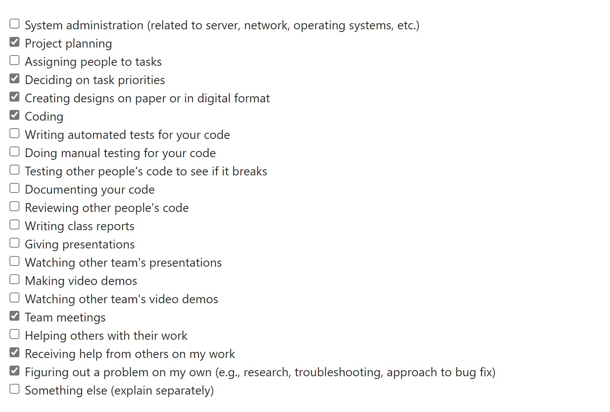
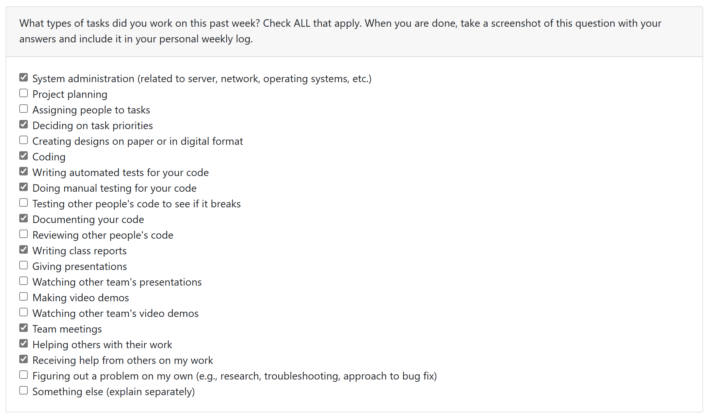
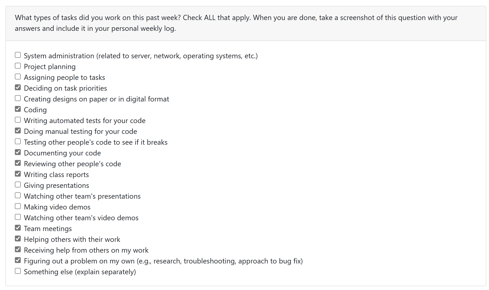
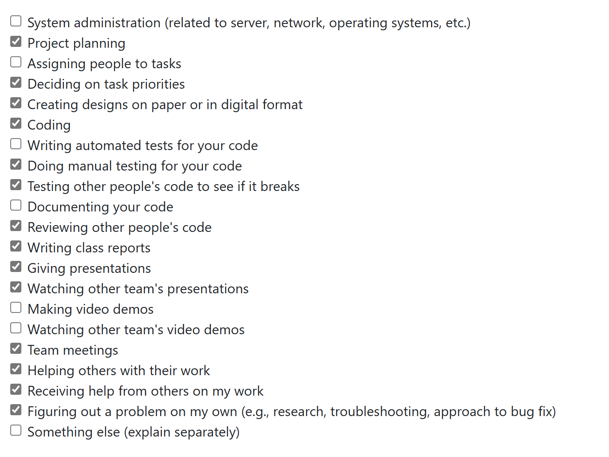

# Weekly Personal Log - Mackenzie Kudrenecky

### Date Range
 - September 25 - October 1, 2023

### Task Types

### Weekly Goals
- Get a solid overview of what we would like to accomplish in our app
- Decide on a tech stack and framework
- Complete the project plan - scoping, features, and division of labour
- Begin filling the knowledge gaps for our anticipated hurdles

#### Individual goals:
- Contribute to team goals 
- Get an introduction to the React Native
- Contribute to the project plan 
    - Bring ideas for features
    - Discuss strengths and shortcomings
    - Estimate milestone timelines 
- Maintain communication and provide timely contributions and feedback

### Features
- Project Plan
- Task associated with this feature: "Project Plan (#2)"
    - completed

### Work Period
 - October 2 - 8, 2023

### Task Types

### Weekly Goals
- Explore the tech stack
- Set up development environment for Django and React Native
- Build test app - test environment to ensure the team's machines are working are ready to go
- Get started on Figma prototypes
- Start planning to code

#### Individual goals:
- Get an introduction to the Django Rest Frame work and React Native coupling
- Go through a test project development to set up environment and familiarize with process
- Start planning a login and home page
- Explore figma for more UI details
- Maintain communication and provide timely contributions and feedback

### Student Tasks on Project Board
<!-- 
- Tasks undertaken on the project board
-->
- item#1 set up project environment
- item#2 get figma up and running for design
- item#3 create mockups in figma for ui/ux
- item#4 begin paper prototyping
- item#5 user testing

### Which Tasks Are Completed vs. In Progress
<!--
- list of completed tasks
- list of tasks to be done
✓ x
-->

| Item # | Completed | To Be Done |
|:------:|:----------|:-----------|
|   1    | ✓         |            |
|   2    | ✓         |            |
|   3    |           | ✓          |
|   4    |           | ✓          |
|   5    |           | ✓          |

### Work Period
<!-- 
- start/end dates of the week
-->
October 9 - 22, 2023

### Individual Peer Evaluation
<!-- 
- screenshot of the weekly peer evaluation
-->

### Recap of Students Goals
<!--
- what tasks are you aiming to have completed by the end of the week
-->
- Launch the backend in Django Rest Framework
- Create an API to authenticate users
- Create an API to create users
- Create a 'product' model to get an idea how we will store and display data
- Extend Django's built in User model class to have it fit our needs (ongoing)
- Refactor Django and JWT token authentication based on username to email
- Connect the front and back end -> run django and react servers and have the API consumed by the user interface
- Unit testing

### Student Tasks on Project Board
<!-- 
- Tasks undertaken on the project board
-->
- item 31 - user model unit tests
- item 32 - product view unit test
- item 33 - user views unit tests
- item 34 - create custom user model
- item 35 - token authentication api
- item 38 - create product model and views
- item 39 - user model views (crud)

### Which Tasks Are Completed vs. In Progress
<!--
- list of completed tasks
- list of tasks to be done
✓ x
-->

| Item # | Completed  | To Be Done |
|:------:|:-----------|:-----------|
| 31      |      ✓      |            |
| 32      |      ✓      |            |
| 33      |      ✓     |            |
| 34      |      ✓     |            |
| 35      |      ✓      |            |
| 38      |      ✓      |            |
| 39      |      ✓      |            |

### Work Period
<!-- 
- start/end dates of the week
-->
October 23 - 29, 2023

### Individual Peer Evaluation
<!-- 
- screenshot of the weekly peer evaluation
-->

### Recap of Students Goals
<!--
- what tasks are you aiming to have completed by the end of the week
-->
- Refine authorization
- Refactor API for jwt token authorizatoin
- Manage authentication in front end using Context
- Use context to manage state
- Implement logout and redirects if user is not authenticated
- Learn some front end (React Native) workflows

### Student Tasks on Project Board
<!-- 
- Tasks undertaken on the project board
-->
- item 49 - handle authentication in the front end
- task is ongoing but have made some solid progress. A few issues to debug

### Which Tasks Are Completed vs. In Progress
<!--
- list of completed tasks
- list of tasks to be done
✓ x
-->

| Item # | Completed  | To Be Done |
|:------:|:-----------|:-----------|
| 49      |            |      ✓      |

### Work Period
<!-- 
- start/end dates of the week
-->
October 30 - November 05, 2023

### Individual Peer Evaluation
<!-- 
- screenshot of the weekly peer evaluation
-->

### Recap of Students Goals
<!--
- what tasks are you aiming to have completed by the end of the week
-->
- Continue to refine authorization
- Manage authentication in front end using Context
- Handle JWT tokens in the front end
- Use context throughout the app the control state and authentication
- Refresh tokens on a time interval
- Check for tokens, log out user if tokens not valid
- Update ER diagram
- Update Architecture diagram
- Demo the app

### Student Tasks on Project Board
<!-- 
- Tasks undertaken on the project board
-->
- item 49 - handle authentication in the front end
- item 65 - design document
- item 64 - system architecture diagram
- item 63 - ER diagram - have a working prototype but is a living document and may change as our needs evolve

### Which Tasks Are Completed vs. In Progress
<!--
- list of completed tasks
- list of tasks to be done
✓ x
-->

| Item # | Completed  | To Be Done |
|:------:|:-----------|:-----------|
| 49      |     ✓      |           |
| 65     |           |      ✓      |
| 64      |           |     ✓       |
| 63      |           |     ✓       |
