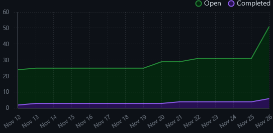

# Team 8 Log

## Work Period
September 24 - October 1, 2023

## Milestone Goals
- Decide on tech stack and framework
- Scope project
- Establish a list of core features and a list of 'nice to have' features to add if able
- Estimate milestone feature implementations
- Discuss strengths and weaknesses of team
- Divide features to team members
- Taking an Agile approach these assignments are open to change

## Features
- No features to be implemented at this time

## Burnup Chart
 

## Project Board
- This week's task is to complete the Project Plan
- Project Plan assigned to: 
    - aroizmand (Alex Roizman)
    - mkudrenecky (Mackenzie Kudrenecky)
    - brandonjmack (Brandon Mack)
    - jossw24 (Joss White)

## Test Report
- No tests at this time

## Work Period
<!-- 
- start/end dates of the week
-->
October 1 - October 8, 2023

### Project Board
<!-- 
- screenshot of the projects board
-->
https://github.com/orgs/COSC-499-W2023/projects/39/views/1 
 

### Username Map
<!-- 
- team members usernames
-->
- Joss White: jossw24
- Alexander Roizman: aroizmand
- Mackenzie Kudrenecky: mkudrenecky
- Brandon Mack: brandonjmack

### Milestone Goals
<!--
- goals that are to be done
-->
- create figma accounts and get a group session set up
- get the project environment set up

### Completed Tasks
<!--
- tasks that are completed
-->
- create figma accounts and get a group session set up
- get the project environment set up

### In Progress Tasks
<!--
- tasks that are currently in progress
-->
- creating mockups for ui/ux
- paper prototyping
- user testing

### Burnup Chart
<!-- 
- graph showcasing the view of tasks done, tasks in progress and tasks left to do
-->
https://github.com/orgs/COSC-499-W2023/projects/39/insights
 

### Test Report
<!-- 
- put all tests in the tests/ directory in your repo

- add screenshot(s) of test run summary 
-->
no coding this week so no testing

## Work Period
<!-- 
- start/end dates of the week
-->
October 9 - October 22, 2023

### Project Board
<!-- 
- screenshot of the projects board
-->
 

### Username Map
<!-- 
- team members usernames
-->
- Joss White: jossw24
- Alexander Roizman: aroizmand
- Mackenzie Kudrenecky: mkudrenecky
- Brandon Mack: brandonjmack

### Milestone Goals
<!--
- goals that are to be done
-->
- Finish environment setup on our machines
- Create Django Rest Framework back-end setup
- Create React Native front-end setup
- Create UI design on Figma for login and sign up page
- Implement UI desgin on React Native
- Implement some basic password security on the front-end (strength, hide/show)
- Add dynamic UI to login/sign up page
- Modify basic React Native App to consume REST Api.
- Authentication and registration (front-end)
- Authentication and registration (back-end)

### Completed Tasks
<!--
- tasks that are completed
-->
- Finish environment setup on our machines
- Create Django Rest Framework back-end setup
- Create React Native front-end setup
- Create UI design on Figma for login and sign up page
- Implement UI desgin on React Native
- Implement some basic password security on the front-end (strength, hide/show)
- Add dynamic UI to login/sign up page
- Modify basic React Native App to consume REST Api.
- Authentication and registration (front-end)
- Authentication and registration (back-end)

### In Progress Tasks
<!--
- tasks that are currently in progress
-->
- UI improvenets
- Sign-up/registration
- more user testing
- Database management
- Learning frameworks and researching map tools for react native

### Burnup Chart
<!-- 
- graph showcasing the view of tasks done, tasks in progress and tasks left to do
-->

### Test Report
<!-- 
- put all tests in the tests/ directory in your repo

- add screenshot(s) of test run summary 
-->
We have created tests for several endpoints in our API and model instances. Link below to a detailed test report.

Link to test report: https://docs.google.com/spreadsheets/d/1FBrUeVV5Cd8wz9DuIdbsoAJ5li21dVPH2hWoPFV3x38/edit?usp=sharing

## Work Period
<!-- 
- start/end dates of the week
-->
October 23 - October 29, 2023

### Project Board
<!-- 
- screenshot of the projects board
-->

### Username Map
<!-- 
- team members usernames
-->
- Joss White: jossw24
- Alexander Roizman: aroizmand
- Mackenzie Kudrenecky: mkudrenecky
- Brandon Mack: brandonjmack

### Milestone Goals
<!--
- goals that are to be done
-->
- Authentication and registration (front-end)
- Manage state
- Handle security of storing user data - tokens, email, id
- Extend user model to store more details
- Implement email based authentication
- Upgrade backend security with permissions/authentication
- Refactor User Details view API
- Profile Page
- User details page

### Completed Tasks
<!--
- tasks that are completed
-->
- JWT token authentication for API calls 
- User model refactor
- User details page API
- User Details page
- Profile page
- User details API 

### In Progress Tasks
<!--
- tasks that are currently in progress
-->
- Managing State
- AuthContext for portable state solution to store data

### Burnup Chart
<!-- 
- graph showcasing the view of tasks done, tasks in progress and tasks left to do
-->

### Test Report
<!-- 
- put all tests in the tests/ directory in your repo

- add screenshot(s) of test run summary 
-->
We have created tests for several endpoints in our API and model instances. Link below to a detailed test report.

Link to test report: https://docs.google.com/spreadsheets/d/1FBrUeVV5Cd8wz9DuIdbsoAJ5li21dVPH2hWoPFV3x38/edit?usp=sharing

October 30 - November 5, 2023

### Project Board
<!-- 
- screenshot of the projects board
-->

### Username Map
<!-- 
- team members usernames
-->
- Joss White: jossw24
- Alexander Roizman: aroizmand
- Mackenzie Kudrenecky: mkudrenecky
- Brandon Mack: brandonjmack

### Milestone Goals
<!--
- goals that are to be done
-->
- Profile page back-end functionality
- Integrate to a MySQL database
- Extend the product model
- Create location model and configure with map API
- Create review model
- Create dietary restrictions model
- Create message model
- Create photo model
- Implement email based authentication
- System Architecture diagram
- ER diagram
- Side Hamburger style menu

### Completed Tasks
<!--
- tasks that are completed
-->
- Authentication and registration (front-end)
- Manage state
- Handle security of storing user data - tokens, email, id
- Extend user model to store more details
- JWT token authentication for API calls
- Upgrade backend security with permissions/authentication
- Refactor User Details view API
- Profile Page front-end
- User details page
- User model refactor
- Side menu

### In Progress Tasks
<!--
- tasks that are currently in progress
-->
- Implement email based authentication
- System Architecture diagram
- ER diagram
- Side Hamburger style menu
- Profile page back-end functionality
- Documentation
- UI refinements
- Authentication refactoring

### Burnup Chart
<!-- 
- graph showcasing the view of tasks done, tasks in progress and tasks left to do
-->

### Test Report
<!-- 
- put all tests in the tests/ directory in your repo

- add screenshot(s) of test run summary 
-->
We have created tests for several endpoints in our API and model instances. Link below to a detailed test report.

https://docs.google.com/spreadsheets/d/1FBrUeVV5Cd8wz9DuIdbsoAJ5li21dVPH2hWoPFV3x38/edit?usp=sharing

## Work Period
<!-- 
- start/end dates of the week
-->
November 6 - November 12, 2023

### Project Board
<!-- 
- screenshot of the projects board
-->

### Username Map
<!-- 
- team members usernames
-->
- Joss White: jossw24
- Alexander Roizman: aroizmand
- Mackenzie Kudrenecky: mkudrenecky
- Brandon Mack: brandonjmack

### Milestone Goals
<!--
- goals that are to be done
-->
- Integrate to a MySQL database
- Create location model and configure with map API
- Create review model
- Create dietary restrictions model
- Create message model
- Create photo model
- Implement email based authentication
- Basic Listing page
- Homepage main view

### Completed Tasks
<!--
- tasks that are completed
-->
- Profile page back-end functionality
- ER diagram
- Side Hamburger style menu
- Integrate API calls into front-end - Profile Page
- API Helpers startercode for back-end consumption
- Back-end filtering
- Configuration file for easier connection to Expo Go Mobile environment
- Product model re-factor for categorical filtering
- Configuration script to facilitate expo/emulator launch + connections
- Logout functionality

### In Progress Tasks
<!--
- tasks that are currently in progress
-->
- Implement email based authentication
- System Architecture diagram
- Documentation
- UI refinements
- Profile page display of all User data
- Add listing page front end
- Homepage front end

### Burnup Chart
<!-- 
- graph showcasing the view of tasks done, tasks in progress and tasks left to do
-->
!

### Test Report
<!-- 
- put all tests in the tests/ directory in your repo

- add screenshot(s) of test run summary 
-->
We have created tests for several endpoints in our API and model instances. Link below to a detailed test report.

https://docs.google.com/spreadsheets/d/1FBrUeVV5Cd8wz9DuIdbsoAJ5li21dVPH2hWoPFV3x38/edit?usp=sharing

# Team 8 Log

### Work Period
<!-- 
- start/end dates of the week
-->
November 13 - November 26, 2023

### Project Board
<!-- 
- screenshot of the projects board
-->
https://github.com/orgs/COSC-499-W2023/projects/39/views/1 
 

### Username Map
<!-- 
- team members usernames
-->
- Joss White: jossw24
- Alexander Roizman: aroizmand
- Mackenzie Kudrenecky: mkudrenecky
- Brandon Mack: brandonjmack

### Milestone Goals
<!--
- goals that are to be done
-->
- Implement the logic and user messages on the edit profile page (#125)
- Edit profile page documentation (#126)
- Edit profile page testing (#127)
- User based Products
- Images model - store and display images with products
- Search functionality
- Configure Expo Go with backend and create configuration file (#131)
- System architecture diagram

### Completed Tasks
<!--
- tasks that are completed
-->
- Redo the profile page and reimplement the backend functionality (#121)
- Start the settings page in the drawer to allow users to navigate to the edit profile page (#122)
- Implement the front end of the edit profile page (#123)
- Implement the backend functionality of the edit profile page (#124)
- Profile page documentation (#50)
- refactor Product model to link to User #86
- link products to Users API call #87
- integrate user-products into front-end #98
- test case for filtering #99
- test case for user owned products #100
- API call to user owned products #101
- Implement Search for title+content #110
- test cases for search functionality (backend) #111
- API helper function for search in front end #112
- Implement image storage for products backend #113
- API helper to post product (text only) #114
- API helper to make post with images #115
- Best before date and valid flag on product model #116
- functionality to update valid flag based on current date #117
- test cases for valid flag and best before #118
- Forgot password backend tests #109
- Creating configuration file and IP getter #132
- Configure EXPO Go with DRF #131
- System architecture diagram

### In Progress Tasks
<!--
- tasks that are currently in progress
-->
- Edit profile page documentation (#126)
- Edit profile page testing (#127)
- Implement the logic and user messages on the edit profile page (#125)
- Test front-back end communication for images
- Forgot password sending external email (#130)
- Forgot password api endpoint configuration (#129)

### Burnup Chart
<!-- 
- graph showcasing the view of tasks done, tasks in progress and tasks left to do
-->
https://github.com/orgs/COSC-499-W2023/projects/39/insights
 

### Test Report
<!-- 
- put all tests in the tests/ directory in your repo

- add screenshot(s) of test run summary 
-->

https://docs.google.com/spreadsheets/d/1FBrUeVV5Cd8wz9DuIdbsoAJ5li21dVPH2hWoPFV3x38/edit?usp=sharing

### Work Period
<!-- 
- start/end dates of the week
-->
November 27 - December 3, 2023

### Project Board
<!-- 
- screenshot of the projects board
-->
https://github.com/orgs/COSC-499-W2023/projects/39/views/1 
 

### Username Map
<!-- 
- team members usernames
-->
- Joss White: jossw24
- Alexander Roizman: aroizmand
- Mackenzie Kudrenecky: mkudrenecky
- Brandon Mack: brandonjmack

### Milestone Goals
<!--
- goals that are to be done
-->
- Add listing
- Settings with add account detail edit
- Demo video
- Design document
- Forgot password
- Finish product model/api calls 

### Completed Tasks
<!--
- tasks that are completed
-->
- Add listing
- Settings with add account detail edit
- Demo video
- Design document

### In Progress Tasks
<!--
- tasks that are currently in progress
-->
- Edit profile page testing (#127)
- Implement the logic and user messages on the edit profile page (#125)
- Add map feature (#137)
- Forgot password sending external email (#130)
- Forgot password api endpoint configuration (#129)
- Automated testing with GitHub issues (#135)
- Create images model (#72)

### Burnup Chart
<!-- 
- graph showcasing the view of tasks done, tasks in progress and tasks left to do
-->
https://github.com/orgs/COSC-499-W2023/projects/39/insights
 

### Test Report
<!-- 
- put all tests in the tests/ directory in your repo

- add screenshot(s) of test run summary 
-->

https://docs.google.com/spreadsheets/d/1FBrUeVV5Cd8wz9DuIdbsoAJ5li21dVPH2hWoPFV3x38/edit?usp=sharing

### Work Period
<!-- 
- start/end dates of the week
-->
January 6 - January 14, 2024

### Project Board
<!-- 
- screenshot of the projects board
-->
https://github.com/orgs/COSC-499-W2023/projects/39/views/1 
 

### Username Map
<!-- 
- team members usernames
-->
- Joss White: jossw24
- Alexander Roizman: aroizmand
- Mackenzie Kudrenecky: mkudrenecky
- Brandon Mack: brandonjmack

### Milestone Goals
<!--
- goals that are to be done
-->
- Add listing refinements
- Settings with add account detail edit
- Forgot password with email code
- Finish product model/api calls
- Map api

### Completed Tasks
<!--
- tasks that are completed
-->
- Add listing refinements
- Settings with add account detail edit
- Demo video
- Design document

### In Progress Tasks
<!--
- tasks that are currently in progress
-->
- Edit profile page testing (#127)
- Implement the logic and user messages on the edit profile page (#125)
- Add map feature (#137)
- Forgot password sending external email (#130)
- Forgot password api endpoint configuration (#129)
- Automated testing with GitHub issues (#135)
- Create images model (#72)
- Front end image handling
- increase and test secuirty measures for forgot password
- SendGrid API

### Burnup Chart
<!-- 
- graph showcasing the view of tasks done, tasks in progress and tasks left to do
-->
https://github.com/orgs/COSC-499-W2023/projects/39/insights
 

### Test Report
<!-- 
- put all tests in the tests/ directory in your repo

- add screenshot(s) of test run summary 
-->

https://docs.google.com/spreadsheets/d/1FBrUeVV5Cd8wz9DuIdbsoAJ5li21dVPH2hWoPFV3x38/edit?usp=sharing
