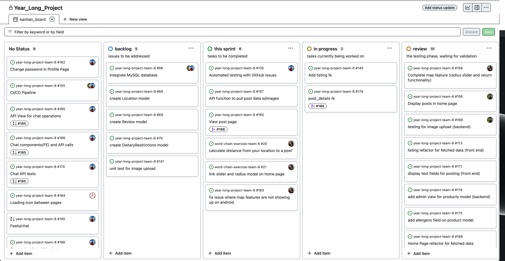

# Team 8 Log

## Work Period
September 24 - October 1, 2023

## Milestone Goals
- Decide on tech stack and framework
- Scope project
- Establish a list of core features and a list of 'nice to have' features to add if able
- Estimate milestone feature implementations
- Discuss strengths and weaknesses of team
- Divide features to team members
- Taking an Agile approach these assignments are open to change

## Features
- No features to be implemented at this time

## Burnup Chart
 

## Project Board
- This week's task is to complete the Project Plan
- Project Plan assigned to: 
    - aroizmand (Alex Roizman)
    - mkudrenecky (Mackenzie Kudrenecky)
    - brandonjmack (Brandon Mack)
    - jossw24 (Joss White)

## Test Report
- No tests at this time

# Team 8 Log

### Work Period
<!-- 
- start/end dates of the week
-->
January 21-28, 2024

### Project Board
<!-- 
- screenshot of the projects board
-->
https://github.com/orgs/COSC-499-W2023/projects/39/views/1 
 

### Username Map
<!-- 
- team members usernames
-->
- Joss White: jossw24
- Alexander Roizman: aroizmand
- Mackenzie Kudrenecky: mkudrenecky
- Brandon Mack: brandonjmack

### Milestone Goals
<!--
- goals that are to be done
-->
- fix an issue where the map distance circle is not working on android
- find a way to link the sliders on the map and on the home page modal
- help implement the reviews function onto the profile page

### Completed Tasks
<!--
- tasks that are completed
-->
- #193 edit profile is not updating the profile page information
- #194 review stars having functionality issues

### In Progress Tasks
<!--
- tasks that are currently in progress
-->
- #21 link slider and modal on home page
- #20 calculate the distance from the users location to a post
- #183 fix issues that arose with the map on android

### Burnup Chart
<!-- 
- graph showcasing the view of tasks done, tasks in progress and tasks left to do
-->
https://github.com/orgs/COSC-499-W2023/projects/39/insights 

### Test Report
<!-- 
- put all tests in the tests/ directory in your repo

- add screenshot(s) of test run summary 
-->

